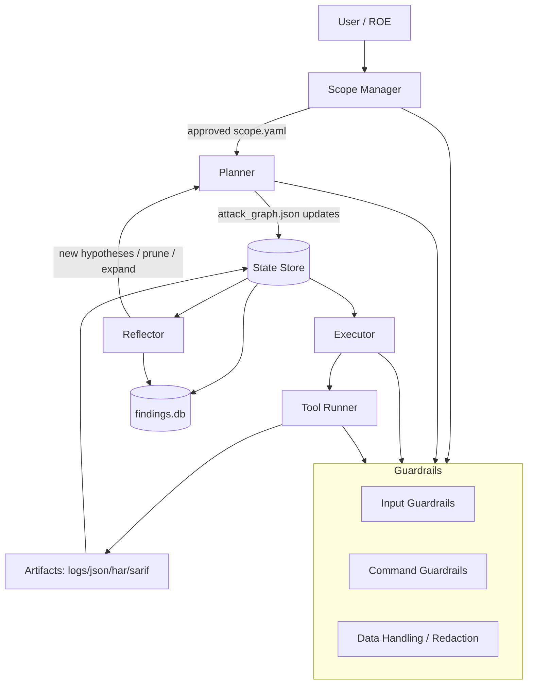
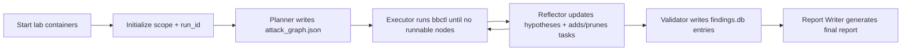
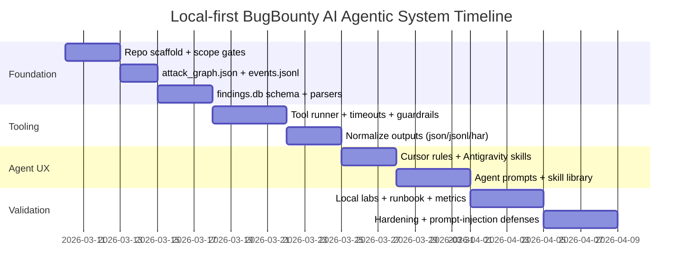

# Building a Local-First BugBounty AI Agentic System

## Executive summary

A practical “elite” BugBounty AI Agentic System (local-first, Cursor/Antigravity-friendly) should center on three ideas proven across modern agentic pentest projects: a Planner–Executor–Reflector loop (P‑E‑R), durable state (sessions + audit logs + artifacts), and sandboxed tool execution with explicit safety controls. This combines (a) modular agent pipelines that mitigate context loss (a key issue documented in the PentestGPT research)citeturn16view0turn7view2, (b) controllable agent coordination with HITL + guardrails (emphasized by CAI)citeturn14view2turn14view1, and (c) “evidence-first” reasoning + DAG planning patterns (as articulated by LuaN1aoAgent)citeturn9view0.

Your best path is to build a **local orchestration repo** that: (1) stores scope, plans, and evidence in deterministic files (`attack_graph.json`) plus a small DB (`findings.db`), (2) wraps external tools behind a narrow “tool runner” interface, (3) uses Cursor Rules / Antigravity Skills to load the right playbooks on demand, and (4) integrates third-party agent frameworks only behind safety gates (many are explicitly designed to send real attack payloads). For example, Shannon’s docs explicitly call out authorization requirements and prompt-injection risk from scanned reposciteturn11view3turn11view0, while BugTraceAI-CLI states it performs active exploitation and should only be used with explicit permissionciteturn12view0turn8view5.

The deliverables below give you: a concrete multi-agent design, a full repo scaffold, ready-to-paste system/per-agent prompts for Cursor/Antigravity, safe skill templates (methodology + heuristics + non-destructive PoC structure), a tool integration strategy with parsing/persistence patterns, a memory/messaging design, local deployment steps, a prioritized “repos + files to read” list, and a runnable validation plan using local vulnerable labs (so you can test the loop legally).citeturn17search13turn17search9turn17search0

## Goals, assumptions, and safety boundaries

This plan assumes you want **local-first execution** (plans, evidence, and artifacts stay on your machine), while Cursor/Antigravity supplies the “brain” through conversational agents and rules/skills. It also assumes you will only scan **explicitly authorized targets** (your own apps, staging, or bug bounty scope with written permission). Multiple leading tools emphasize this: Shannon warns unauthorized scanning/exploitation is illegal and requires written authorizationciteturn11view3, and PentestGPT’s artifact appendix highlights privacy/data leakage and misuse risk when using LLM APIs and automated workflowsciteturn16view1.

Operationally, you should treat “agent + shell access” as high risk. LuaN1aoAgent explicitly warns that high-privilege tools (shell/python execution) should be isolated (containers/VMs) to protect the hostciteturn9view0. PentAGI similarly positions sandboxed Docker execution as a core feature and calls out Docker isolation as central to safe operationciteturn8view0. CAI formalizes this with “Guardrails” that validate inputs/outputs and block dangerous commands, plus HITL as a core design principleciteturn14view2turn14view1.

Finally, you should assume **prompt injection** risk whenever an agent reads untrusted codebases or web content. Shannon explicitly warns about prompt injection from scanned repositoriesciteturn11view3. If you also adopt MCP-based tool integration, be aware research has found broad security risks in MCP ecosystems if servers/tools are untrusted; treat MCP servers as code that must be audited and isolated.citeturn30academia34

## Research-backed patterns to borrow from existing projects

Several projects you named contain “battle-tested” architectural patterns worth reusing (without copying their offensive payload logic):

- PentestGPT’s research motivation is that naive LLM usage struggles with maintaining overall context; their framework uses multiple interacting modules to mitigate context loss.citeturn16view0  
  Its current repository documents an event-bus + session store approach, with a controller lifecycle that supports pausing/resuming and structured prompts per mode.citeturn7view1

- PentAGI emphasizes sandboxed Docker execution, a tool suite, and a “smart memory system,” and it documents memory components (working/episodic/long-term) plus observability integrations.citeturn8view0turn10view0turn10view1

- CAI frames agent systems in terms of Agents/Tools/Handoffs/Patterns/Turns/Tracing/Guardrails/HITL, and includes explicit guidance on where to start reading the code (entrypoints, prompts, tools).citeturn14view2turn14view0

- LuaN1aoAgent provides a clean “cognitive loop” decomposition (Planner–Executor–Reflector), plus “evidence→hypothesis→validation” causal-graph thinking and a task-DAG (“Plan-on-Graph”) representation for dynamic replanning.citeturn9view0

- Shannon (Lite) is a white-box agent for repos + running apps, with structured configuration for authentication flows and explicit scope/safety guidance. It also demonstrates repo layout that separates configs/prompts/MCP server/components.citeturn11view0turn11view3

- Strix demonstrates practical product features you should replicate at the repo layer: file-based “instructions” for ROE/scope, persistent on-disk run outputs, and persistence of CLI config across runs.citeturn22view2turn13view0turn22view3

- BugTraceAI-CLI’s strongest transferable design is not “payload mutation,” but its **multi-persona consensus** stage to reduce false positives and its explicit pipeline staging; also note its strong disclaimer that it performs active exploitation and sends real payloads.citeturn12view0turn8view5

- entity["company","ProjectDiscovery","security tools vendor"]’s Neo product messaging is useful as a conceptual north star: long-running tasks, memory, sandboxed execution, integrations, and full audit logs; it also emphasizes that coding assistants alone struggle with long-running security workflows.citeturn15view0turn15view1

## Multi-agent architecture with responsibilities

The architecture below is “Planner‑Executor‑Reflector + specialists,” local-first state, and a strict scope/safety gate. It is inspired by P‑E‑R cognitive separation (LuaN1aoAgent)citeturn9view0, controller/event-bus/session persistence patterns (PentestGPT)citeturn7view1, and explicit guardrails/HITL (CAI)citeturn14view2.

### Architecture overview



### Agent roster and responsibilities

| Agent | Core responsibility | Inputs | Outputs |
|---|---|---|---|
| Scope Manager | Enforce ROE and scope allowlist; decide what level of testing is permitted (passive vs active). Inspired by CAI guardrails/HITL and Shannon’s legal/scope guidance.citeturn14view2turn11view3 | `scope.yaml`, user ROE notes | `scope_lock.json`, “allowed actions” policy |
| Planner | Build/maintain a task DAG in `attack_graph.json`, using evidence-first reasoning and reversible edits (add/update/deprecate nodes), similar to LuaN1ao “Plan-on-Graph.”citeturn9view0turn10view0 | current state/evidence, skill playbooks | Updated `attack_graph.json`, planned tool runs |
| Executor | Run only the next eligible DAG nodes; never invent scope; capture outputs deterministically; short context focus like LuaN1ao “Executor.”citeturn9view0 | runnable nodes from DAG | artifacts + event log updates |
| Reflector | Validate whether evidence supports hypotheses; detect loops; summarize learnings into “memory notes” and propose plan revisions. Mirrors LuaN1ao “Reflector” and PentestGPT-style structured reflection to mitigate context loss.citeturn9view0turn16view0 | artifacts + findings | hypothesis confidence updates; pruned/added tasks |
| Recon Specialist | Run safe discovery primitives (asset enumeration, probing, crawling) and normalize outputs (JSONL/JSON) for downstream agents. Recon pipelines are a well-defined phase in systems like BugTraceAI and PentAGI.citeturn12view0turn8view0 | scope targets | `targets.jsonl`, `endpoints.jsonl` |
| Auth & Session Specialist | Handle login flows safely, store non-secret session artifacts, and ensure automation doesn’t test logout/irrelevant routes (Shannon supports explicit auth flows and avoid/focus rules).citeturn11view0turn11view3 | `auth.yaml`, captured HAR | `session_context.json`, safe replay steps |
| Validator | Convert “possible findings” into “reportable findings” via reproduction steps + evidence checklist + severity rationale, similar in spirit to “proof-by-exploitation” approaches but constrained to non-destructive PoCs.citeturn8view4turn11view3 | candidate issues | `findings.db` inserts + report snippets |
| Report Writer | Generate final markdown report, change log, and a remediation checklist; keep everything traceable to artifacts. Systems like Strix emphasize actionable output and persistent reports.citeturn22view3turn13view0 | findings + evidence | `reports/final.md`, `reports/summary.json` |

### State model: `attack_graph.json` + `findings.db`

You want a **single source of truth** for planning and a separate **append-only evidence log**:

- `attack_graph.json`: a DAG of tasks with explicit dependencies, statuses, and evidence pointers. This mirrors “plan-on-graph” ideas (LuaN1aoAgent)citeturn9view0 and aligns with PentAGI’s documented “action/artifact/memory” modeling.citeturn10view0  
- `findings.db` (SQLite): structured, queryable canonical findings; your Report Writer should only cite items that have evidence paths and “safe reproduction steps.”

## Repo structure, file templates, and prompts

This section gives you a complete repo skeleton plus copy-paste templates for prompts and skills. It is designed to work with Cursor Rules (Markdown rule files, including `.md` and `.mdc` with frontmatter for targeted applicability).citeturn29search0  
For Antigravity, it maps cleanly to “Skills” as optional scripts/resources the agent can load by name/description.citeturn29search1turn29search11

### Repository layout

```text
bugbounty-ai-agent/
  README.md
  scope/
    scope.yaml
    scope_lock.json
    rules_of_engagement.md
  state/
    attack_graph.json
    events.jsonl
    run_state.json
    findings.db
  artifacts/
    runs/
      <run_id>/
        tool_outputs/
        har/
        screenshots/
        reports/
  agents/
    system_prompt.md
    planner.md
    executor.md
    reflector.md
    recon_specialist.md
    auth_specialist.md
    validator.md
    report_writer.md
    web_researcher.md
  skills/
    SKILL_TEMPLATE.md
    idor.md
    graphql.md
    jwt.md
    xss.md
    ssrf.md
    auth_testing.md
  tools/
    tool_registry.yaml
    adapters/
      run_cmd.py
      parse_nuclei.py
      parse_httpx.py
      parse_ffuf.py
    scripts/
      bbctl.py
      init_db.py
      next_tasks.py
  docker/
    docker-compose.lab.yml
    docker-compose.agent.yml
  .cursor/
    rules/
      bugbounty-system.mdc
      skills-loader.mdc
      safety-guardrails.mdc
  antigravity.skills/
    bugbounty-planner/
      SKILL.md
    bugbounty-executor/
      SKILL.md
    bugbounty-reflector/
      SKILL.md
```

### Core local artifacts

#### `scope/scope.yaml` template (the safety linchpin)

```yaml
scope_id: "local-lab-default"
allowed_targets:
  # Safe defaults: local-only. Expand only with written authorization.
  hosts:
    - "localhost"
    - "127.0.0.1"
    - "::1"
  url_prefixes:
    - "http://localhost:"
    - "http://127.0.0.1:"
    - "https://localhost:"
    - "https://127.0.0.1:"
allowed_actions:
  passive_recon: true
  authenticated_testing: true
  active_fuzzing: false        # require HITL flip
  exploitation: false          # keep false; PoCs must be non-destructive
rate_limits:
  http_rps: 2
  tool_timeouts_seconds:
    default: 300
    browser: 900
data_handling:
  store_raw_http: true
  redact_secrets_in_reports: true
human_in_the_loop:
  required_for:
    - "active_fuzzing"
    - "any command that modifies server state"
notes:
  - "Expand scope only with explicit written authorization."
```

#### `state/attack_graph.json` schema starter

```json
{
  "run_id": "RUN_YYYYMMDD_HHMMSS",
  "scope_id": "local-lab-default",
  "target": {
    "type": "url",
    "value": "http://localhost:3000"
  },
  "nodes": [
    {
      "id": "n1",
      "kind": "recon",
      "title": "Probe HTTP surface",
      "description": "Enumerate reachable base URLs and capture basic headers/statuses.",
      "tool": "httpx",
      "command_template": ["httpx", "-silent", "-probe", "-list", "artifacts/runs/<run_id>/inputs/hosts.txt"],
      "depends_on": [],
      "status": "PENDING",
      "artifacts": [],
      "evidence": []
    }
  ],
  "edges": [],
  "policies": {
    "no_exploitation": true,
    "require_hitl_for_active_fuzzing": true
  }
}
```

### `bbctl` runner skeleton

This runner is intentionally minimal: it executes *only* tasks already in `attack_graph.json` after verifying scope and guardrails, then writes artifacts and events.

```python
# tools/scripts/bbctl.py
import json, os, shlex, sqlite3, subprocess, time
from pathlib import Path

def load_json(path: Path):
    return json.loads(path.read_text(encoding="utf-8"))

def append_event(events_path: Path, evt: dict):
    with events_path.open("a", encoding="utf-8") as f:
        f.write(json.dumps(evt) + "\n")

def is_target_allowed(scope: dict, target: str) -> bool:
    # Minimal: local-only default. Expand with strict matching rules in production.
    return any(target.startswith(p) for p in scope.get("allowed_targets", {}).get("url_prefixes", []))

def command_is_safe(cmd: list[str]) -> bool:
    # Conservative denylist for obvious dangerous patterns.
    joined = " ".join(cmd).lower()
    deny = ["reverse shell", "nc -e", "bash -i", "powershell -enc", "rm -rf", ":(){:|:&};:"]
    return not any(x in joined for x in deny)

def run_cmd(cmd: list[str], cwd: Path, timeout_s: int) -> tuple[int, str, str]:
    p = subprocess.run(cmd, cwd=str(cwd), capture_output=True, text=True, timeout=timeout_s)
    return p.returncode, p.stdout, p.stderr

def main():
    repo = Path(__file__).resolve().parents[2]
    scope = load_json(repo / "scope" / "scope_lock.json")
    graph_path = repo / "state" / "attack_graph.json"
    events_path = repo / "state" / "events.jsonl"
    graph = load_json(graph_path)

    target = graph["target"]["value"]
    if not is_target_allowed(scope, target):
        raise SystemExit(f"Target not allowed by scope_lock.json: {target}")

    run_id = graph["run_id"]
    run_dir = repo / "artifacts" / "runs" / run_id / "tool_outputs"
    run_dir.mkdir(parents=True, exist_ok=True)

    # Execute next PENDING node with all dependencies DONE.
    done = {n["id"] for n in graph["nodes"] if n["status"] == "DONE"}
    runnable = []
    for n in graph["nodes"]:
        if n["status"] != "PENDING":
            continue
        if all(dep in done for dep in n.get("depends_on", [])):
            runnable.append(n)

    if not runnable:
        print("No runnable nodes.")
        return

    node = runnable[0]
    cmd = [part.replace("<run_id>", run_id) for part in node["command_template"]]

    if not command_is_safe(cmd):
        raise SystemExit(f"Blocked by command guardrails: {shlex.join(cmd)}")

    append_event(events_path, {"ts": time.time(), "type": "NODE_START", "node_id": node["id"], "cmd": cmd})

    out_path = run_dir / f"{node['id']}.stdout.txt"
    err_path = run_dir / f"{node['id']}.stderr.txt"
    rc, out, err = run_cmd(cmd, cwd=repo, timeout_s=int(scope["rate_limits"]["tool_timeouts_seconds"].get("default", 300)))
    out_path.write_text(out, encoding="utf-8")
    err_path.write_text(err, encoding="utf-8")

    node["status"] = "DONE" if rc == 0 else "FAILED"
    node["artifacts"].extend([str(out_path), str(err_path)])
    graph_path.write_text(json.dumps(graph, indent=2), encoding="utf-8")

    append_event(events_path, {
        "ts": time.time(), "type": "NODE_END", "node_id": node["id"], "rc": rc,
        "stdout": str(out_path), "stderr": str(err_path)
    })
    print(f"Executed {node['id']} rc={rc}")

if __name__ == "__main__":
    main()
```

### Ready-to-paste “elite” prompts for Cursor/Antigravity

These prompts are written to make the system behave like a disciplined operator: evidence-first, scope-constrained, audit-friendly, and tool-minimal (a recurring best practice theme in agent harness discussions).citeturn15view0turn14view2

#### Master system prompt (`agents/system_prompt.md`)

Paste this as the system prompt for your main “Orchestrator” chat.

```md
You are BugBounty AI Orchestrator operating in a LOCAL-FIRST repository.

Non-negotiable rules:
- Authorization: Only operate on targets explicitly allowed in scope/scope_lock.json. If unclear, stop and ask for scope clarification.
- Safety: No exploit code, no destructive actions, no credential theft, no persistence, no lateral movement. Use only non-destructive validation patterns suitable for authorized testing.
- Evidence-first: Every claim must cite an artifact path (tool output, HAR, screenshot, or code location). If you cannot cite evidence, label it as a hypothesis and create a task to gather evidence.
- Deterministic state: Plans live in state/attack_graph.json. Findings live in state/findings.db. All execution produces artifacts under artifacts/runs/<run_id>/.
- Minimal tools: Use the fewest tools needed; prefer cheap probes first (status/headers/routes) before heavier scans.
- HITL gates: If scope.yaml says HITL is required for an action category, stop and request human approval before proceeding.

Workflow loop:
1) READ: scope/scope_lock.json + state/attack_graph.json + latest state/events.jsonl + latest artifacts.
2) PLAN: Update attack_graph.json using small diffs (add/update/deprecate nodes). Keep tasks short and testable.
3) EXECUTE: Ask Executor to run bbctl against the next runnable nodes. Never handwave execution.
4) REFLECT: Update hypotheses, confidence, and next tasks; prune dead ends; write memory notes.

Output format:
- Start with: Current run_id, target, and what evidence you saw.
- Then: a proposed plan patch (exact JSON edits).
- Then: the next 1–3 runnable nodes to execute.
```

#### Planner agent prompt (`agents/planner.md`)

```md
Role: Planner (Strategic Brain).
Goal: Maintain a high-quality task DAG in state/attack_graph.json.

Rules:
- Only modify the plan via explicit graph edits (ADD_NODE / UPDATE_NODE / DEPRECATE_NODE).
- Every node must have: (id, kind, title, description, tool, command_template, depends_on, status).
- Prefer parallelizable tasks with clear dependencies.
- Use skills/*.md as methodology. If a skill is missing, create a new skill file before planning the task.
- Add "evidence_needed" fields when a hypothesis lacks proof.

Deliverable each turn:
- A concise rationale.
- A JSON patch-style list of changes (human-readable).
- The updated attack_graph.json content block (only the changed parts, not the whole file).
```

#### Executor agent prompt (`agents/executor.md`)

```md
Role: Executor (Tactical Operator).
Goal: Execute only what the plan requests, safely, and capture artifacts.

Rules:
- Do not invent new steps. Do not broaden scope.
- Before running anything: confirm scope/scope_lock.json allows the target and action type.
- Run tasks using tools/scripts/bbctl.py (or a tool-specific wrapper if defined).
- Always write outputs to artifacts/runs/<run_id>/tool_outputs and append to state/events.jsonl.
- If a tool fails, capture stderr, note likely cause, and stop.

Deliverable each turn:
- Commands executed (exact).
- Artifact paths produced.
- Any errors + immediate remediation suggestion (install missing tool, adjust timeout, etc.).
```

#### Reflector agent prompt (`agents/reflector.md`)

```md
Role: Reflector (Audit + Learning).
Goal: Turn raw artifacts into evidence-backed conclusions and next steps.

Rules:
- Separate hypotheses from confirmed findings.
- For each candidate issue: list evidence, reproduction outline (safe, non-destructive), impact reasoning, and what additional proof is required.
- Update attack_graph.json to prune loops and add missing evidence tasks.
- Add memory notes to state/run_state.json: patterns that worked, endpoints of interest, auth nuances, tool quirks.

Deliverable each turn:
- “What we know” (evidence-backed).
- “What we suspect” (hypotheses).
- “What to do next” (plan edits).
```

### Cursor Rules / Antigravity Skills scaffolds

Cursor supports rules as Markdown files, and supports `.mdc` files with frontmatter metadata (description/globs) to control when rules apply.citeturn29search0turn29search2  
Antigravity Skills are “optional scripts and resources” that an agent can use; at conversation start, the agent sees available skills by name/description.citeturn29search1turn29search11

A minimal Cursor `.mdc` rule you can start with:

```md
---
description: BugBounty agent safety + state discipline
globs: scope/**,state/**,agents/**,skills/**,tools/**
alwaysApply: true
---

- Enforce scope/scope_lock.json strictly.
- Plans must modify state/attack_graph.json, not freeform.
- Executor must use tools/scripts/bbctl.py for execution and produce artifacts.
- No exploit code. Only safe, non-destructive PoCs and evidence-based reporting.
```

A minimal Antigravity skill (`antigravity.skills/bugbounty-planner/SKILL.md`) pattern:

```md
---
name: bugbounty-planner
description: Maintains attack_graph.json as a task DAG for safe, authorized security testing.
---

When invoked:
- Read scope_lock.json, attack_graph.json, and recent artifacts.
- Output a minimal set of DAG edits and 1-3 next tasks.
```

## Skill markdown templates and examples

These “skills” are designed for **methodology + heuristics + safe reproduction structure**, without shipping exploit payloads. This aligns with your requirement to avoid exploit code while still supporting validation and reporting.

### Universal skill template (`skills/SKILL_TEMPLATE.md`)

```md
# Skill: <NAME>

## Scope & safety
- Allowed only if target is in scope_lock.json and ROE permits this class of testing.
- No destructive actions. No data exfiltration. No credential reuse outside the test accounts.

## What to collect (evidence checklist)
- Requests/responses (HAR or raw).
- Screenshots (if UI).
- Exact endpoint + parameters involved.
- Account roles used (A vs B) and expected authorization boundary.

## Detection heuristics
- <heuristic bullets>

## Safe test procedure
1) Establish baseline behavior with authorized account.
2) Change only one variable per test.
3) Record responses and verify access-control outcome.
4) If suspicious, add a “Validator” task for safe confirmation.

## False-positive killers
- Caching, CDN variation, object-level RBAC rules, tenant boundaries, soft deletes.

## Remediation guidance
- Server-side authorization checks, deny-by-default, consistent object scoping, audit logs.

## Report-ready writeup template
- Title:
- Affected component:
- Impact:
- Evidence:
- Safe reproduction steps:
- Suggested fix:
```

### IDOR skill (`skills/idor.md`)

```md
# Skill: IDOR / Broken Object Level Authorization

## Detection heuristics
- Object IDs in path/query/body with predictable formats.
- Responses differ by ID but do not appear to enforce ownership/tenant checks.
- “403/404 on UI but 200 via direct API call” mismatch.

## Safe test procedure (two-account method)
1) Create two authorized test users: UserA and UserB.
2) With UserA, access an object UserA owns and capture the request (HAR).
3) Identify the object identifier field(s).
4) Repeat the same request as UserB with the same identifier.
5) Record whether the server returns:
   - Proper denial (expected), or
   - Data/behavior implying unauthorized access (candidate issue).
6) If candidate issue: create Validator task to test boundary conditions (tenant switch, role escalation) without extracting sensitive content.

## Evidence checklist
- HAR showing UserA request + response.
- HAR showing UserB request + response.
- Notes on expected authorization policy.

## Remediation
- Enforce server-side checks at every object access.
- Avoid relying on client-side filtering.
```

### GraphQL skill (`skills/graphql.md`)

```md
# Skill: GraphQL Security Testing

## Detection heuristics
- Publicly reachable GraphQL endpoint(s).
- Overly permissive queries returning cross-tenant data.
- Missing rate limits / query complexity constraints.

## Safe test procedure
1) Identify GraphQL endpoint(s) from traffic capture (HAR) or app config.
2) Enumerate operations via any documented API schema sources (OpenAPI/Postman equivalents if present).
3) For each operation that returns user/tenant objects:
   - Verify it enforces tenant scoping with UserA vs UserB.
4) Record evidence in HAR; never dump large datasets.

## Remediation
- Enforce authorization in resolvers.
- Add query depth/complexity limits and rate limits.
```

### JWT skill (`skills/jwt.md`)

```md
# Skill: JWT Validation & Session Integrity

## Detection heuristics
- JWT used as bearer/session token.
- Server accepts tokens across environments or unexpected audiences.
- Error messages suggest weak validation (but must be confirmed by evidence).

## Safe test procedure
1) Capture a legitimate login flow and token issuance (HAR).
2) Verify server-side validation signals:
   - Expiry enforcement (token rejected after expiry).
   - Audience/issuer enforcement (token rejected if mismatched).
   - Algorithm constraints (server rejects unexpected token headers).
3) Never attempt token forging. Focus on observing validation behavior via safe, minimal parameter changes permitted by ROE (e.g., using a known-expired token).

## Remediation
- Strict validation of iss/aud/exp/nbf.
- Key management hygiene and rotation.
```

### XSS skill (`skills/xss.md`)

```md
# Skill: XSS (Detection + Safe Validation Structure)

## Detection heuristics
- Unescaped reflection of user input in HTML/JS contexts.
- Stored display of user-generated content without encoding.

## Safe test procedure
1) Use a unique, non-executable marker string to find reflection points.
2) Determine context: HTML body, attribute, script, URL, etc.
3) If reflection is unescaped, create Validator task:
   - Validate in a local lab / staging first.
   - Use only non-destructive, program-approved proof (no data access, no persistence, no phishing).
4) Capture screenshot and DOM context evidence.

## Remediation
- Context-aware output encoding.
- Trusted Types / CSP where applicable.
```

### SSRF skill (`skills/ssrf.md`)

```md
# Skill: SSRF (Heuristic + Evidence-Driven Confirmation)

## Detection heuristics
- Server fetches user-supplied URLs (webhooks, image fetchers, link previews, importers).
- Error messages indicate outbound fetch attempts.

## Safe test procedure
1) Identify any URL-fetch feature and capture baseline behavior.
2) Use a controlled “canary” endpoint you own (or a sanctioned collaborator) to confirm whether the server performs outbound requests.
3) Confirm constraints:
   - Allowed schemes/ports
   - DNS rebinding protections
   - IP range blocks
4) Do not probe internal metadata endpoints or internal services unless explicitly permitted in ROE.

## Remediation
- Strict allowlist of domains, egress proxying, DNS pinning, IP range blocks, and request sanitization.
```

### Auth testing skill (`skills/auth_testing.md`)

```md
# Skill: Authentication & Authorization Testing

## What to verify
- Session lifecycle: login, refresh, logout, invalidation.
- MFA/TOTP handling (if used).
- Access control boundaries across roles/tenants.

## Safe test procedure
1) Capture login flow and post-login navigation (HAR).
2) Verify cookies/session flags and revocation behavior through observed responses.
3) Check common auth boundary endpoints (profile, admin, billing) with UserA vs UserB.
4) If automation is used, encode the login flow steps explicitly (Shannon-style “login_flow” is a good pattern). 
```

## Tool integration plan with orchestration patterns

This integration plan focuses on deterministic outputs (JSON/JSONL/HAR/SARIF/Markdown), scope-aware rate limiting, and safe defaults.

### Tooling patterns to standardize on

- Prefer tools that can emit machine-readable output:
  - Nmap output formats (normal/XML/grepable + `-oA`)citeturn21search7turn21search15  
  - Amass JSON output option exists (`-json out.json`)citeturn19search1turn19search5  
  - httpx supports piping + Docker runs in docs and includes an explicit “Use with caution” banner in examplesciteturn24view0  
  - Nuclei supports JSON export (`-json-export`), JSONL (`-jsonl`), markdown export, SARIF export, and a reporting DB (`-rdb`) for persistence/dedupingciteturn25view0  
  - ffuf supports JSON output files (`-of json`) and JSONLines stdout mode (`-json`)citeturn26view0  
  - mitmproxy supports HAR export (via `hardump`) and in-client `save.har`citeturn20search7turn19search6  
  - Burp Suite exposes a REST API and strongly recommends binding only to loopback and requiring API keysciteturn23search1turn20search14  
  - Playwright supports network observation/modification and tracing to capture network activityciteturn19search3turn19search7

- Install/maintain ProjectDiscovery tools via PDTM rather than ad-hoc binaries when possible. PDTM’s repo and docs describe installation and binary management, including install-all and binary path behavior.citeturn30search2turn30search6turn30search9

### Tool registry example (`tools/tool_registry.yaml`)

```yaml
httpx:
  output: "jsonl"
  runner: "docker"     # or "host"
  safety_level: "passive"
nuclei:
  output: "jsonl"
  reporting_db: true
  safety_level: "active_scanner"
ffuf:
  output: "json"
  safety_level: "active_fuzzer"
nmap:
  output: "xml+normal+grepable"
  safety_level: "network_scanner"
amass:
  output: "json"
  safety_level: "recon"
mitmproxy:
  output: "har"
  safety_level: "proxy"
burp:
  output: "html"
  safety_level: "interactive_scanner"
playwright:
  output: "trace_zip+har"
  safety_level: "browser_automation"
```

### Orchestration patterns

**Pattern: “Cheap-first funnel”**  
1) Enumerate/probe → 2) Normalize URLs/endpoints → 3) Run template-based scans with strict rate limits → 4) Validate a small shortlist manually/with safe automation → 5) Report.

This mimics staged pipelines described in BugTraceAI-CLI (multi-phase)citeturn12view0 and aligns with Nuclei’s reporting DB and output modes for continuous scanning/deduplication.citeturn25view0

**Pattern: “Consensus before escalation”**  
Before any higher-risk test category (fuzzing, complex auth chains), require:
- multiple analysis passes (Planner + Reflector + Validator), similar in spirit to BugTraceAI’s persona voting to reduce false positivesciteturn12view0  
- HITL approval if scope demands it (CAI’s HITL emphasis)citeturn14view1turn14view2

### Safe example CLI snippets (local-lab oriented)

These are templates; the Scope Manager must enforce `scope_lock.json` first.

```bash
# Nmap: write deterministic outputs (all formats) for parsing
nmap -sV -oA artifacts/runs/<run_id>/tool_outputs/nmap_local 127.0.0.1
```

Nmap output controls and `-oA` semantics are documented in the official Nmap guide.citeturn21search7turn21search15

```bash
# httpx: example from docs shows piping enumeration into probes and Docker usage
cat hosts.txt | docker run -i projectdiscovery/httpx > artifacts/runs/<run_id>/tool_outputs/httpx.txt
```

The httpx “Running” docs include Docker piping examples and caution language.citeturn24view0

```bash
# nuclei: JSON export + report-db for deduping
nuclei -l urls.txt -json-export artifacts/runs/<run_id>/tool_outputs/nuclei.json -rdb artifacts/runs/<run_id>/tool_outputs/nuclei_rdb
```

Nuclei output flags and `-rdb` are documented in ProjectDiscovery docs.citeturn25view0

```bash
# ffuf: store JSON results and optionally stream JSONLines on stdout
ffuf -w wordlist.txt -u http://localhost:3000/FUZZ -o artifacts/runs/<run_id>/tool_outputs/ffuf.json -of json
```

ffuf’s wiki documents output formats and JSON/JSONLines modes.citeturn26view0

```bash
# mitmproxy: export HAR on exit (useful for evidence capture)
mitmdump --set hardump=artifacts/runs/<run_id>/har/capture.har
```

HAR export via `hardump` is documented by mitmproxy.citeturn20search7turn20search3

## Deployment, CI-style local runs, and a validation runbook

### Local deployment steps

1) Create the repo scaffold above and initialize `scope.yaml` to local-only defaults (do not expand until you have written authorization). Shannon’s documentation explicitly stresses written authorization and warns about misuse.citeturn11view3

2) “Lock” scope into `scope_lock.json` (so runs are reproducible).

3) Install toolchain:
- For ProjectDiscovery tools, install PDTM (Go install) and then install required tools; PDTM behavior is documented in the PDTM repo/docs.citeturn30search2turn30search9  
- For Nuclei specifically, ProjectDiscovery docs describe installation options and note Go version requirements.citeturn30search5turn25view0  
- For Amass, the user guide documents `amass enum` and `-json` output option.citeturn19search1turn19search5

4) Start with a local lab target (recommended). OWASP Juice Shop is explicitly intended as a vulnerable training app, and OWASP provides Docker run instructions.citeturn17search29turn17search13  
For GraphQL practice, DVGA is an intentionally vulnerable GraphQL app useful for local learning.citeturn17search0

### Docker compose: local lab (`docker/docker-compose.lab.yml`)

```yaml
services:
  juice-shop:
    image: bkimminich/juice-shop
    ports:
      - "127.0.0.1:3000:3000"
  dvga:
    image: dolevf/dvga:latest
    environment:
      - WEB_HOST=0.0.0.0
    ports:
      - "127.0.0.1:5013:5013"
```

OWASP Juice Shop run guidance (local bind to 127.0.0.1:3000) and DVGA Docker image usage are documented publicly.citeturn17search13turn17search24

### Prioritized repos and specific files to inspect

This list focuses on the highest-signal code paths for patterns you’ll copy into your system (event bus, session store, guardrails, prompts, configs, install scripts).

| Repo / project | Why it matters | Key files / paths to inspect |
|---|---|---|
| GreyDGL/PentestGPT | Battle-tested controller/event bus/session persistence; prompt structure; benchmark harness.citeturn7view1turn7view2 | `pentestgpt/core/controller.py`, `pentestgpt/core/events.py`, `pentestgpt/core/session.py`, `pentestgpt/prompts/`citeturn7view1 |
| vxcontrol/pentagi | Docker sandboxing, memory modeling, observability stacks, provider configs.citeturn8view0turn10view0turn10view1 | `docker-compose.yml`, `.env`, memory/ERD sections, compose overlays (observability/graph)citeturn10view1turn10view0 |
| aliasrobotics/cai | Clear conceptual model for agents/tools/handoffs/turns/guardrails/HITL; lists “start here” files.citeturn14view2turn14view1 | `cli.py`, `core.py`, `agents/`, `prompts/`, `tools/`, `repl/`citeturn14view2 |
| KeygraphHQ/shannon | Practical config for auth flows and scope rules; repo layout separating configs/prompts/MCP server; explicit safety guidance.citeturn11view0turn11view3 | `configs/example-config.yaml`, `prompts/`, `mcp-server/`, `docker-compose.yml`citeturn11view0turn11view3 |
| usestrix/strix | “Instruction file” pattern and persistent run outputs; scan modes; config persistence.citeturn22view2turn13view0turn22view3 | behavior: `--instruction-file`, output dir `strix_runs/<run-name>`, config `~/.strix/cli-config.json`citeturn22view2turn22view3turn13view0 |
| BugTraceAI ecosystem | Useful for pipeline staging and UI patterns; but includes active exploitation—integrate only behind strict gates and local labs.citeturn12view0turn8view5 | `BugTraceAI-Launcher/install.sh` & `launcher.sh` (review before running)citeturn6view1; Web UI prompt layout (`services/prompts/`)citeturn12view1 |
| SanMuzZzZz/LuaN1aoAgent | Strong conceptual model: P‑E‑R roles, evidence/hypothesis causal graphs, SQLite persistence, HITL mode.citeturn9view0 | `agent.py`, `rag/`, SQLite usage (`luan1ao.db`), HITL env flagsciteturn9view0 |
| six2dez/reconftw | Large recon pipeline wrapper; install script patterns and modular recon workflows for inspiration (use only when in-scope).citeturn30search0turn30search4 | `install.sh`, `reconftw.sh`citeturn30search4turn30search7 |
| projectdiscovery/pdtm | Practical toolchain management for ProjectDiscovery suite.citeturn30search2turn30search6 | README install + usage sectionciteturn30search2 |

### Local validation test plan and metrics

**Objective:** prove that the loop converges (plan → execute → reflect → report) using only local targets.

**Runbook**



**Steps**

1) Bring up the lab compose. (Use loopback bindings.)citeturn17search13turn17search24  
2) Create `scope_lock.json` from `scope.yaml`.  
3) Set `run_id` and initial `attack_graph.json`.  
4) Iterate:
   - Planner adds 3–8 nodes: probe, crawl, template scan with strict rate-limit, auth capture, validation tasks.
   - Executor runs `bbctl.py` until no runnable nodes.
   - Reflector summarizes artifacts into hypotheses and updates DAG.
5) Stop when:
   - No runnable nodes remain, or
   - Reflector marks the run “complete,” or
   - Scope/time budget reached.

**Expected outputs**
- `state/events.jsonl` grows with NODE_START/NODE_END events (audit trail).  
- `artifacts/runs/<run_id>/tool_outputs/` contains deterministic logs.  
- `state/findings.db` contains only evidence-backed findings (or explicit “none found”).  
- `artifacts/runs/<run_id>/reports/final.md` exists, referencing evidence paths.

**Metrics to track**
- Convergence: number of loop iterations until “no runnable nodes.”
- Tool reliability: % of nodes with rc=0.
- Noise control: % of candidate issues rejected by Validator (proxy for false positives).
- Coverage: number of distinct endpoints discovered + tested.
- Auditability: % of findings with complete evidence checklist.

### Implementation timeline



## Security, legal, and operational checklist

Use this as a hard gate before running against anything beyond localhost:

- Written authorization is mandatory; tools like Shannon explicitly require it and warn about legal consequences of misuse.citeturn11view3  
- Protect secrets: Burp’s REST API docs warn that disabling API keys is unsafe even on loopback, and recommend avoiding non-loopback binding on untrusted networks.citeturn23search1turn20search14  
- Sandbox tool execution: PentAGI and LuaN1aoAgent both emphasize isolation for high-privilege toolchains.citeturn8view0turn9view0  
- Treat repo/web content as untrusted input: Shannon notes prompt injection risk from scanned repositories.citeturn11view3  
- If you adopt MCP tooling, audit servers and isolate them; research shows MCP ecosystems can be coerced into harmful tool use when poorly controlled.citeturn30academia34  
- Avoid blindly running `curl | bash` installers; if you must use tools like BugTraceAI Launcher, review the scripts first and run in a disposable environment. The Launcher advertises a one-command deployment/management workflow and contains extensive interactive logic, so it should be reviewed like any privileged deploy script.citeturn6view1turn8view5