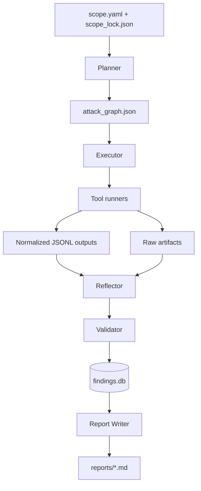

# Mirage BugBounty AI Agentic System Research Report

## Executive summary

Your current Mirage repository is a strong foundation for an “elite” local-first BugBounty AI system: it already has a clear agent lineup (Planner/Executor/Reflector + specialists), durable state (`attack_graph.json`, `events.jsonl`, `findings.db`), and a local lab compose file. That puts you ahead of most “LLM + scanner” prototypes.

The two biggest upgrades to make next are:

- Expand your **skills library** to cover the highest-yield web/API bug bounty classes (based on the latest OWASP Top 10 and OWASP API Top 10), and add **agent-security skills** to defend your own system from prompt injection and unsafe tool calls. citeturn16search0turn15view0turn16search6  
- Strengthen your **orchestration discipline** using patterns from `karpathy/autoresearch` (keep/discard loop, immutable evaluator, parse-friendly telemetry), but adapted to security (explicit stop conditions and HITL gates instead of “loop forever”). citeturn3view0turn3view1

On the “do these repos help?” question:

- `karpathy/autoresearch` is directly useful for autonomy mechanics (iteration loop, immutable evaluator, “single mutable surface”) and aligns with your existing `autoloop.py` direction. citeturn3view0turn3view1  
- `666ghj/MiroFish` is not a bug bounty repo, but it can inspire **graph-based memory + simulation** patterns; it is **AGPL-3.0** and uses external services (LLM APIs and Zep Cloud), so it’s not a clean local-first dependency. citeturn3view2turn6view0turn9view0  
- `jackwener/twitter-cli` is useful as an **OSINT intake tool** (security release monitoring, writeups, researcher chatter) because it supports structured YAML/JSON outputs for agent integration; however, you should treat it as “optional” and be mindful of ToS/operational risk. citeturn8view0turn6view5  
- `Ed1s0nZ/CyberStrikeAI` is architecturally relevant (YAML tool recipes, roles/skills directories, MCP integration, audit/logging), but it is a high-risk project to adopt directly (unclear repo-level license; plus credible reporting ties it to real-world malicious usage). You can safely borrow **design ideas**, but I recommend **not vendoring it** into Mirage. citeturn4view0turn4view1turn12view0turn12view1  
- The entity["organization","THOR Collective Dispatch","cybersecurity substack"] posts by entity["people","Josh Rickard","security engineer writer"] are highly applicable to your Cursor/Antigravity workflow: they explicitly advocate “skills/workflows as markdown,” role-stacking, and guardrails—basically validating your current approach and giving you patterns to harden it. citeturn13view0turn13view1

Assumptions (because you didn’t specify): Windows (WSL2) local dev, moderate CPU/GPU, and that all scans are performed only on explicitly authorized targets (or local labs). Your repo already includes ROE/scope controls; keep those as non-negotiable.

## Assessment of the proposed repos

### Summary table

| Source | What it is | How it helps Mirage | License / maturity | Key risks |
|---|---|---|---|---|
| `karpathy/autoresearch` | Autonomous “research loop” that iterates experiments under a fixed time budget and keeps/discards changes. citeturn3view0turn3view1 | Best-in-class pattern for **iteration discipline**: immutable evaluator, parse-friendly metrics, keep/revert via git, single mutable file constraints. citeturn3view0 | README states MIT; repo is small and actively evolving. citeturn3view1turn3view0 | Its default “run forever / disable permissions” stance is unsafe for security tooling unless replaced with scope+HITL gates. citeturn3view0 |
| `666ghj/MiroFish` | Multi-agent “swarm intelligence” prediction/simulation engine that builds GraphRAG, personas, and long-term memory. citeturn9view0 | Useful for ideas: **graph building**, “report agent,” persona injection, temporal memory updates. citeturn9view0 | AGPL-3.0; large app with frontend/backend; expects LLM APIs + Zep Cloud. citeturn6view0turn9view0 | AGPL can be incompatible with your intended distribution; not local-first by default; external services expand attack surface. citeturn6view0turn11search2 |
| `jackwener/twitter-cli` | Terminal-first CLI for entity["company","X","social network"] (formerly Twitter) with YAML/JSON output and agent tips. citeturn8view0 | Great for OSINT ingestion into “web_researcher”: track CVEs, vendor advisories, writeups, “bounty program updates” via structured outputs. citeturn8view0turn8view2 | Apache 2.0; ~87 commits; no GitHub releases shown. citeturn8view0turn6view5turn0search22 | ToS/anti-detection obligations; don’t automate posting/liking from an agent in a security toolchain. citeturn8view2 |
| `Ed1s0nZ/CyberStrikeAI` | Large “AI-native security testing platform” with 100+ tool recipes, roles, skills, MCP, audit logs, SQLite persistence. citeturn4view0turn4view1 | Strong architectural inspiration: YAML tool definitions, role-locked tool selection, skills attachment, replayable attack-chain UI. citeturn4view1turn3view5 | Many releases shown; license file not obvious in repo file list. citeturn4view0turn2view3 | High-risk to adopt: credible threat-intel reporting describes real-world malicious use and state-alignment concerns. citeturn12view0turn12view1 |
| THOR Dispatch posts | Practitioner guidance on using LLMs for security work: role stacking, explicit constraints, “skills/workflows as markdown”. citeturn13view0turn13view1 | Validates your design; provides operational patterns for Cursor/Antigravity “skills + workflows” and guardrails. citeturn13view1turn13view0 | A blog series; not a code dependency. | Risk is mainly over-trusting LLM output; the author explicitly warns humans must remain accountable. citeturn13view0 |

### Practical takeaways for Mirage

- **Steal the loop mechanics from autoresearch**, not its content domain: fixed budget, immutable evaluator, and a structured experiment ledger. citeturn3view0turn3view1  
- **Borrow CyberStrikeAI’s config ergonomics** (YAML tool “recipes,” roles that restrict tools and skills), but do **not** import or depend on it directly. citeturn4view1turn12view0  
- Use twitter-cli only as an **optional ingestion tool** for your web research pipeline because it explicitly supports YAML/JSON outputs and “AI agent tips” for output choice. citeturn8view0  
- Treat MiroFish as “architecture inspiration only” unless you accept AGPL obligations and remote-service dependencies. citeturn6view0turn9view0  
- Align your “skills/workflows-as-markdown” approach with THOR Dispatch guidance (role stacking, be specific, define tools/constraints). citeturn13view0turn13view1

## Gap analysis of your current Mirage tree

Your current tree (agents/skills/state/tools/docker/scope) is already structured like a serious local-first harness. The main gaps are about **coverage** (skills), **normalization** (consistent outputs), **safety** (agent security), and **repeatability** (ledger + keep/discard semantics applied consistently to *plans*, not artifacts).

### What’s already strong

- You already implement the **P‑E‑R loop** as discrete prompts (`planner.md`, `executor.md`, `reflector.md`) and maintain persistent run state (attack graph, events, SQLite). This is exactly the “skills/workflows are markdown” pattern described in THOR Dispatch Part 2. citeturn13view1  
- You already have the **autonomy iteration hook** (`autoloop.py`) and an evaluator (`evaluator.py`), which mirrors the `autoresearch` concept of “experiment → measure → keep/discard” under a fixed harness. citeturn3view0  
- You have clear ROE/scope artifacts (`scope.yaml`, `scope_lock.json`, `rules_of_engagement.md`). Keeping these immutable is analogous to autoresearch’s “do not modify evaluator/harness.” citeturn3view0turn3view1

### The most valuable enhancements

**Normalized outputs layer (missing):**  
Right now you store raw tool output files. Add a `normalized/` folder per run with stable JSONL schemas: `hosts.jsonl`, `urls.jsonl`, `endpoints.jsonl`, `params.jsonl`, `candidates.jsonl`. This allows Planner/Reflector to reason over a single canonical dataset rather than scraping each tool’s ad-hoc output.

**Role-based tool/skill gating (missing):**  
CyberStrikeAI demonstrates a practical pattern: roles choose a `user_prompt`, tool allowlist, and skill list; roles are stored as YAML files and can be hot-reloaded. citeturn3view5turn4view1  
You can implement a simpler, local-first version: `roles/` directory in Mirage, with each role mapping to allowed tool adapters + skills to load.

**Agent security skills (missing):**  
Your agentic system itself is a security target. OWASP now maintains a Top 10 for LLM/GenAI apps with explicit risks like prompt injection and supply-chain vulnerabilities—these should be first-class “skills” just like XSS/SSRF. citeturn16search6turn16search4

**Stop conditions and HITL escalation (needs hardening):**  
Autoresearch’s default loop instructions emphasize continuing indefinitely and even suggest disabling permissions; that approach is not appropriate for bug bounty tooling without explicit stop conditions and “human approval required” gates. citeturn3view0  
You already have ROE—now encode stop rules into the evaluator and autoloop.

## Expanded vulnerability skills roadmap

You currently have: auth testing, GraphQL, IDOR, JWT, SSRF, XSS.

That covers important areas, but misses multiple high-yield bug bounty categories. The most defensible way to decide “what skills next” is to align to:

- **OWASP Top 10:2025** (current web app risks) citeturn16search0turn16search13  
- **OWASP API Security Top 10:2023** (API-specific risks—critical for modern bug bounty) citeturn15view0  
- Proven learning taxonomies like PortSwigger Web Security Academy categories (SQLi, CSRF, CORS, etc.) which map well to repeatable skill modules. citeturn10search2turn10search6

### High-priority skill modules to add

| Priority | Skill module | Why it matters | Framework anchor |
|---|---|---|---|
| P0 | `api_bola.md` (BOLA/IDOR extension) | API1:2023 is Broken Object Level Authorization; it’s the #1 API risk; your `idor.md` should be extended with API shapes (GraphQL mutations, REST nested objects). citeturn15view0turn10search1 | OWASP API Top 10 citeturn15view0 |
| P0 | `rate_limit_resource_consumption.md` | API4:2023 Unrestricted Resource Consumption—practical bug bounty wins (abuse, cost impact) without “exploit code.” citeturn15view0 | OWASP API Top 10 citeturn15view0 |
| P0 | `bfla_function_level_authz.md` | API5:2023: Broken Function Level Authorization—classic “user can hit admin actions.” citeturn15view0 | OWASP API Top 10 citeturn15view0 |
| P0 | `injection_sqli.md` | Injection remains core; OWASP highlights both XSS and SQL injection under Injection. citeturn16search8 | OWASP Top 10 citeturn16search8 |
| P0 | `csrf_clickjacking.md` | Frequently reportable in web contexts; PortSwigger explicitly treats CSRF and Clickjacking as major categories/labs. citeturn10search2turn10search14 | PortSwigger WSA citeturn10search2 |
| P0 | `cors_origin.md` | High-yield misconfig class; PortSwigger has dedicated CORS content/labs. citeturn10search2 | PortSwigger WSA citeturn10search2 |
| P1 | `security_misconfiguration.md` | OWASP Top 10:2025 ranks Security Misconfiguration #2; covers headers, debug endpoints, unsafe XML, etc. citeturn16search5turn16search13 | OWASP Top 10 citeturn16search5 |
| P1 | `supply_chain.md` | OWASP Top 10:2025 includes Software Supply Chain Failures as a top category; add a “dependency/outdated components” playbook (SBOM, version checks) without exploit code. citeturn16search2turn16search13 | OWASP Top 10 citeturn16search2 |
| P1 | `exceptional_conditions.md` | OWASP Top 10:2025 adds Mishandling of Exceptional Conditions; bug bounty often finds info leaks and fail-open behavior from edge cases. citeturn16search10 | OWASP Top 10 citeturn16search10 |
| P1 | `unsafe_api_consumption.md` | API10:2023 Unsafe Consumption of APIs: SSRF-like patterns, dependency trust boundaries, webhook ingestion—very relevant. citeturn15view0 | OWASP API Top 10 citeturn15view0 |
| P2 | `agent_security_prompt_injection.md` | Your own system must resist prompt injection and unsafe output handling; OWASP LLM Top 10 includes prompt injection and supply chain vulnerabilities. citeturn16search6turn16search4 | OWASP LLM Top 10 citeturn16search6 |

### Two skills to upgrade (not just add)

- **Upgrade `auth_testing.md`** to incorporate OWASP API2:2023 Broken Authentication patterns (token lifecycle, refresh handling, password reset flows). citeturn15view0turn10search34  
- **Upgrade `idor.md`** into two modules:
  - `idor_web.md` (UI + REST)
  - `bola_api.md` (API-first patterns, especially nested IDs and property-level authorization). citeturn15view0turn10search1

## Implementation-ready enhancements for your repo

This section is intentionally actionable: what to add, where, and how it should interact with existing Mirage components.

### Extend your folder structure minimally

Add:

```text
roles/
  web-app.yaml
  api.yaml
  authenticated.yaml
knowledge/
  owasp_top10_2025_notes.md
  owasp_api_top10_2023_notes.md
  portswigger_checklists.md
normalized/
  schema.md
tests/
  test_scope.py
  test_guardrails.py
  test_parsers.py
```

Why: THOR Dispatch explicitly recommends encoding “what the team knows” into SKILLS.md and workflows, and your repo already uses that approach; adding `roles/` and `knowledge/` makes skills composable and consistent. citeturn13view1turn11search0turn11search1

### Role YAMLs inspired by CyberStrikeAI, but local-first

CyberStrikeAI’s README describes roles that define a `user_prompt`, tool restrictions, and skills attachment via YAML stored under `roles/`. citeturn3view5turn4view1  
You can implement a simplified subset:

```yaml
# roles/api.yaml
name: api
description: API-focused testing with strict ROE, rate-limits, and evidence-first validation.
skills:
  - api_bola
  - bfla_function_level_authz
  - rate_limit_resource_consumption
  - auth_testing
tools_allowed:
  - httpx
  - nuclei
  - ffuf
  - sqlmap   # only if ROE allows; safe mode
defaults:
  max_rps: 2
  require_hitl_for:
    - active_fuzzing
    - auth replay beyond happy-path
```

### Add a normalized-output stage to the Executor

You already have parsers for httpx, ffuf, nuclei. Extend the Executor workflow so every successful tool run produces a normalized JSONL artifact.

Recommended canonical schemas:

- `normalized/urls.jsonl`: `{url, host, scheme, port, status, title?, ts, source_tool, run_id}`
- `normalized/endpoints.jsonl`: `{method, url, path, params, content_type?, auth_required?, evidence_path}`
- `normalized/candidates.jsonl`: `{class, confidence, url, method?, rationale, evidence_paths[]}`

This mirrors what made `twitter-cli` attractive: it explicitly supports structured output contracts and encourages YAML/JSON outputs “for scripting and AI agent integration.” citeturn8view0

### Adopt “autoresesarch-style” iteration but with bug bounty safety gates

Autoresearch’s core loop is: edit → run → parse metric → log results → keep/revert using git. citeturn3view0  
This pattern is ideal for improving *plans and skills* in Mirage, while preserving artifacts outside git.

Key changes for security:

- Replace “NEVER STOP” with:
  - stop at time-box
  - stop if scope boundary detected
  - stop if candidate finding count exceeds a threshold without validation
- Require HITL for escalation categories (active fuzzing, auth replay beyond “two-account swaps,” anything that changes server state).

## Tooling and orchestration improvements

You already have `tool_registry.yaml` and adapters. The next step is to standardize “safe runners” and broaden coverage to crawlers and authenticated scanning.

### Add a crawler tool for richer endpoint discovery

A major gap in many pipelines is finding deep endpoints behind JS routing. ProjectDiscovery’s Katana is designed as a crawler; its docs provide usage guidance. citeturn14search15  
Even if you don’t adopt it immediately, add `katana` support to your registry and plan nodes.

### Use containerized runners for tools that can execute host code

ProjectDiscovery explicitly warns that “running Nuclei as a service may pose security risks.” citeturn14search14  
This aligns with your local-first, guardrailed direction: prefer Dockerized execution (where feasible) and keep strict allowlists for templates (disable “code” execution templates unless your ROE explicitly permits them). citeturn14search18turn14search14

### Improve recon piping patterns

ProjectDiscovery documentation shows the intended “pipe subdomains → httpx” workflow and also provides Docker usage patterns you can mirror in your `command_template` nodes. citeturn14search5turn14search1  

### Capture evidence reliably with HAR

mitmproxy supports HAR import/export in modern versions, and the `hardump` option is documented in its options reference. citeturn14search3turn14search7  
This is particularly valuable for your `auth_specialist.md` and `validator.md`, because HAR files provide durable reproduction evidence without writing exploit code.

## Validation strategy and next steps

### Update your runbook to validate “skills coverage,” not just tool execution

Your local lab compose is a great start. Now add success criteria that proves each new skill creates:

- at least one planned task node in `attack_graph.json`
- at least one normalized artifact record
- a candidate finding that either:
  - is validated and written to `findings.db`, or
  - is clearly rejected with evidence (teaching the Reflector what “false positive” looks like)

This aligns with OWASP’s guidance that not all risks are “easily testable issues” and some require structured process and evidence to avoid shallow scanning. citeturn10search33

### Integration flow diagram for Mirage vNext



### Short implementation checklist

- Add P0 skill files: `api_bola.md`, `bfla_function_level_authz.md`, `rate_limit_resource_consumption.md`, `injection_sqli.md`, `csrf_clickjacking.md`, `cors_origin.md`. citeturn15view0turn16search8turn10search2  
- Add `roles/` concept and enforce tool/skill allowlists per role (inspired by CyberStrikeAI YAML roles/skills). citeturn3view5turn4view1  
- Add `normalized/` artifacts and update parsers to emit canonical JSONL.  
- Extend evaluator to include safety penalties and explicit stop conditions (borrowing autoresearch’s keep/revert structure but replacing “loop forever”). citeturn3view0  
- Add an “agent security” skill covering prompt injection/tool misuse aligned with OWASP LLM Top 10. citeturn16search6turn16search4  
- Treat twitter-cli as optional OSINT ingestion: only read/search/export; disable all write actions in your tool registry if you integrate it. citeturn8view0turn8view2  
- Avoid bundling CyberStrikeAI; borrow patterns only, given credible reporting about malicious adoption and unclear license posture. citeturn12view0turn7view0turn4view0