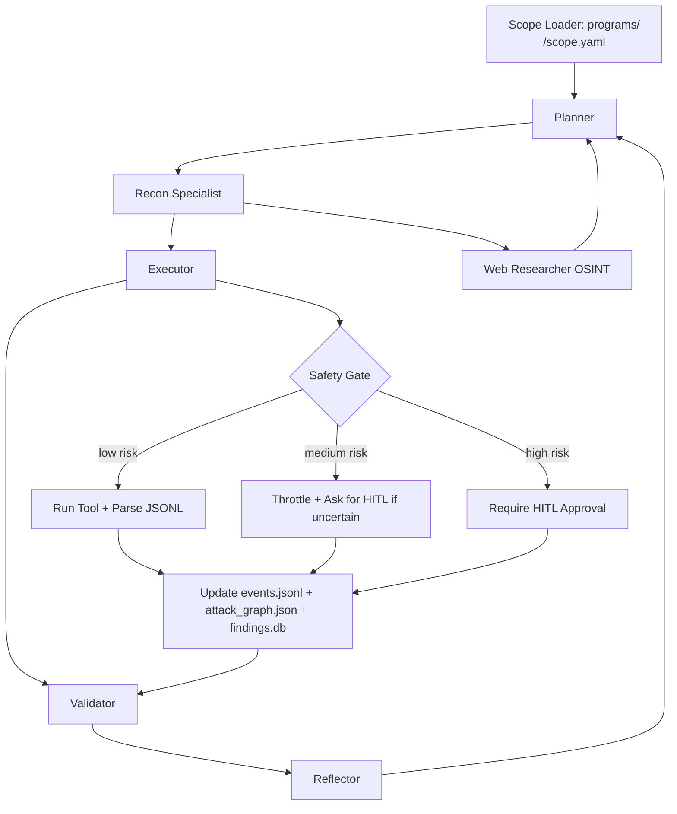
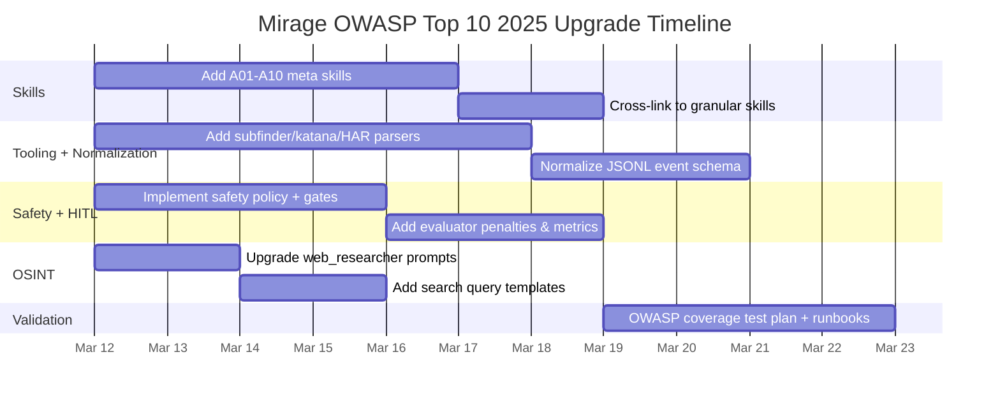

# Mirage Local-First BugBounty AI Agentic System Upgrade Plan for OWASP Top 10 2025

## Executive summary

Mirage’s current structure (agents + skills + tool adapters + per-program state) is already close to what you need for repeatable bug bounty workflows across many companies: it has the foundations for **Planner → Executor → Reflector**, a skills library, program scoping, and persistent artifacts (events, attack graph, findings DB).  

To **cover the full entity["organization","OWASP","open web app security"] Top 10:2025** in a **black‑box-only** way, Mirage needs three upgrades:

First, add **OWASP-aligned “meta skills”** (one per A01–A10) that orchestrate your existing granular skills (IDOR, JWT, SSRF, auth, command injection, etc.) and enforce **non-destructive test steps + evidence checklists**. This is especially important because the 2025 list includes categories that are **hard to validate purely from the outside** (e.g., A03 supply chain failures, A09 logging & alerting failures), requiring OSINT and inference. citeturn22search8turn14search1turn15search4  

Second, broaden tooling and normalization so every scan/crawl/fuzz run produces the same **JSONL event schema**, updates `attack_graph.json`, and writes structured evidence into `findings.db`. This unlocks true agent autonomy (planning from prior states) while keeping human review efficient. Key enablers here are JSONL-capable tools (subfinder/httpx/katana/ffuf) and strict safety gates around higher-risk scanners (ZAP active scan, sqlmap, aggressive fuzzing). citeturn7view0turn5view0turn6view1turn12view2turn17search5  

Third, implement a dedicated **Web Research (OSINT) loop** that continuously enriches the attack graph with tech-stack and historical signals (archived endpoints, leaked docs, public CVEs, public GitHub repos, prior writeups) without crossing scope or violating terms. This matters more in OWASP 2025 because **SSRF is consolidated into A01** and because “hard-to-test” categories require contextual knowledge to prioritize safe tests. citeturn22search8turn22search0turn16search4  

Assumptions (explicit): You are running Mirage on **Windows with WSL2 and/or Kali in WSL**, CPU/GPU unspecified, outbound network access required, and you only test targets where you have explicit authorization and defined rate limits. (WSL guidance here assumes entity["company","Microsoft","windows vendor"] Windows + WSL2.)  

## OWASP Top 10 2025 coverage map

OWASP Top 10:2025 lists A01–A10, with one notable consolidation: **SSRF is rolled into A01 Broken Access Control**, and A10 “Mishandling of Exceptional Conditions” is a new category. citeturn22search8turn22search0turn14search3  

The table below maps each OWASP 2025 item to **black‑box skill modules**, safe methodologies, and recommended tools (including your requested toolchain). When a tool is normally “white‑box” (semgrep, dependency-check), it is marked as **OSINT-only** in black-box: use it only on *publicly available* code/images/specs legitimately tied to the target.

### OWASP 2025 → Mirage skills/tools mapping

| OWASP 2025 item | What it covers (practical black-box view) | Mirage meta-skill to add (new file) | Granular skills you already have / should keep | Primary tools (black-box) | OSINT/white-box-adjacent tools (optional) | Safe test steps (non-destructive) | Evidence checklist |
|---|---|---|---|---|---|---|---|
| A01 Broken Access Control | IDOR/BOLA, privilege escalation, CSRF-class issues, and SSRF now mapped here citeturn22search0turn22search8turn23search0 | `skills/A01_broken_access_control.md` | `idor.md`, `auth_testing.md`, `jwt.md`, `ssrf.md`, `cors_misconfig.md`, `rate_limit_bypass.md`, `business_logic.md` | burp, mitmproxy, playwright (HAR), httpx, katana, ffuf, nuclei (safe templates) | (OSINT) GitHub search for docs/specs | Compare same request as different users/roles; test object IDs with safe reads; SSRF: detect by benign callback/controlled endpoint; never pivot into internal networks without explicit scope | Request/response pairs, user context, object IDs tested, proof of unauthorized access/behavior change, timestamps |
| A02 Security Misconfiguration | Missing headers, open directories, debug endpoints, default creds, permissive CORS, cloud perms symptoms citeturn14search0 | `skills/A02_security_misconfiguration.md` | `cors_misconfig.md`, `open_redirect.md`, `path_traversal.md` (for misconfig-like exposures), plus add “headers” checks in meta | nuclei (exposures/misconfig), httpx (probes), nmap (service/version), katana | trivy/grype/syft (only if public images/artifacts exist) | Passive probes first; confirm misconfig with repeated GET/HEAD; avoid brute force on logins | Screenshot of headers, nuclei evidence, directory listings proof, config leaks redacted |
| A03 Software Supply Chain Failures | Compromises through dependencies/build/distribution; black-box relies on version fingerprinting + OSINT correlation citeturn14search1turn22search8 | `skills/A03_supply_chain_failures.md` | (New subskills recommended) `tech_fingerprinting.md`, `osint_public_repos.md` | nmap (service versions), httpx (server headers), nuclei (CVEs), gau/waybackurls (old assets) | dependency-check, trivy, syft, grype, semgrep (OSINT-only on public repos/images) citeturn19search1turn19search2turn19search8turn19search9turn19search10 | Don’t “exploit CVE”; instead: identify version → validate exposure via read-only endpoint behavior → produce “potentially vulnerable” finding requiring HITL | Version evidence, affected component mapping, reproducible fingerprint steps, scope-safe validation notes |
| A04 Cryptographic Failures | Missing/weak TLS, mixed content, insecure cookies, weak token handling, sensitive data exposure in transit/storage patterns citeturn14search2turn14search3 | `skills/A04_cryptographic_failures.md` | `jwt.md`, `auth_testing.md` | httpx (TLS-related probes), burp/mitmproxy (cookie flags, mixed content), nuclei (tls/misconfig templates) | (OSINT) public policy/docs for crypto posture | Verify TLS enforcement, HSTS presence, cookie flags; avoid credential stuffing | TLS handshake evidence, headers, cookie attributes, token storage observations |
| A05 Injection | SQLi, XSS, command injection, template injection; OWASP notes injection remains widely tested and includes XSS/SQLi citeturn15search0turn23search3 | `skills/A05_injection.md` | `xss.md`, `command_injection.md`, `rce.md`, `path_traversal.md`, add `sqli.md` if missing | burp, ffuf, nuclei (relevant), sqlmap (HITL + detection-only default) citeturn8search0turn12view2 | semgrep (OSINT-only) | Use benign markers & safe payload placeholders; focus on reflection, error behavior, parameterized tests; sqlmap only with explicit approval and conservative settings | Parameter list, payload placeholders used, reflection points, sanitized logs, before/after responses |
| A06 Insecure Design | Business logic flaws, missing rate limits, insecure workflows; cannot be fixed by perfect implementation alone citeturn15search1turn15search11 | `skills/A06_insecure_design.md` | `business_logic.md`, `rate_limit_bypass.md`, `auth_testing.md` | playwright (workflow automation), burp/mitmproxy, katana | (OSINT) docs about workflows & roles | Model workflows, enumerate states, attempt “abuse cases” gently; always throttle and require HITL for abnormal flows | Workflow diagrams, step-by-step reproduction, role assumptions, observed control gaps |
| A07 Authentication Failures | Weak auth/session flows; OWASP describes “tricking system into recognizing invalid/incorrect user as legitimate” citeturn15search2turn23search2turn23search6 | `skills/A07_authentication_failures.md` | `auth_testing.md`, `jwt.md`, `oauth_misconfig.md` | burp, playwright, mitmproxy, httpx | (OSINT) public IdP/config docs | No credential stuffing by default; test session invalidation, MFA flows, password reset logic with explicit scope | Session lifecycle evidence, token rotation checks, response codes, account state changes (if permitted) |
| A08 Software or Data Integrity Failures | Trusting untrusted code/data (plugins/CDNs), insecure update mechanisms, deserialization-class issues; OWASP describes relying on untrusted sources/CDNs citeturn15search3 | `skills/A08_software_data_integrity_failures.md` | `prototype_pollution.md`, `file_upload.md` (integrity of uploads), add “sri/cdn integrity” checks | katana (JS crawl), httpx (asset fetch), nuclei (SRI/misconfig templates), burp | syft/grype/trivy (if public artifacts/images); semgrep (OSINT-only) | Check for missing Subresource Integrity where relevant; check unsigned updates via observable endpoints; avoid uploading executables | Asset URLs, integrity headers, SRI presence, update endpoint behaviors, redaction |
| A09 Security Logging and Alerting Failures | Hard to validate externally; OWASP stresses alerting importance and warns about logging sensitive data and log injection risks citeturn15search4turn15search6 | `skills/A09_logging_alerting_failures.md` | Add “log injection safety checks” references; tie into existing auth skill | burp/mitmproxy (observe IDs), nuclei (log-related misconfig findings where possible) | N/A | Mostly inference: see whether security events produce user-visible IDs, errors; test for “sensitive info in logs” only if logs are exposed | Evidence of exposed logs, headers/correlation IDs, proof of log injection/encoding issues (non-destructive) |
| A10 Mishandling of Exceptional Conditions | New 2025 category: failing open, improper error handling, abnormal-state behavior citeturn14search3turn14search10 | `skills/A10_exceptional_conditions.md` | `business_logic.md`, `rate_limit_bypass.md`, `path_traversal.md` (edge errors) | ffuf (careful), playwright (edge flows), nuclei (error disclosures), burp | N/A | Low-rate fuzzing of boundary inputs; test “fail open” behaviors without stressing systems | Error traces redacted, differing auth decisions on error paths, consistent reproduction |

## New OWASP 2025 skill modules to drop into `skills/`

Below are **10 ready-to-paste meta-skill files** following a practical SKILL_TEMPLATE style (goal → scope/safety → methodology → heuristics → steps → evidence → automation hooks). They use **placeholders** like `{{PAYLOAD}}` and explicitly avoid destructive guidance. The intent is for your Planner to load these first, then fan out to granular skills.

### `skills/A01_broken_access_control.md`

```md
# SKILL: A01 Broken Access Control (OWASP Top 10:2025)

## Goal
Identify and validate broken access control issues (IDOR/BOLA, privilege escalation, CSRF-class behaviors, SSRF mapped under A01) using black-box methods.

## Scope & Safety (Non-negotiable)
- Only test in-scope hosts/paths in `programs/<program>/scope.yaml`.
- Default to read-only requests (GET/HEAD) and low-rate probing.
- Any action that modifies state (POST/PUT/DELETE), touches admin functions, or attempts SSRF to internal IP ranges requires HITL approval.

## Core ideas (black-box)
- Access control = server-side authorization enforcement per request.
- Look for object identifiers in URLs, JSON bodies, GraphQL variables, headers.
- Test horizontal (same role, different user/object) and vertical (role escalation) cases.

## Detection heuristics
- ID patterns: sequential IDs, UUIDs, base64-ish tokens, slug+id combos.
- “Soft” authorization: UI hides links but API still accepts requests.
- Inconsistent authorization across methods: GET locked down, PATCH not; list endpoint restricted but detail endpoint open.

## Safe test steps
1. **Inventory endpoints**
   - Use passive capture (Burp/mitmproxy) while browsing.
   - Use katana/gau/wayback to find hidden endpoints.
2. **Build role matrix**
   - At minimum: unauthenticated, normal user, any available secondary role.
3. **IDOR/BOLA checks (read-only first)**
   - Replay the same request with:
     - different object id (`{{OBJECT_ID_OTHER_USER}}`)
     - same id but different auth context
   - Observe: 200 vs 403/404, data differences, property-level leaks.
4. **Function-level auth checks**
   - Enumerate “admin-like” endpoints (e.g., /admin, /internal, /manage).
   - Try safe GET/OPTIONS first.
5. **SSRF mapped under A01 (detection-only by default)**
   - Identify fetcher features (URL previews, webhooks, PDF generation, image proxy).
   - Use a benign controlled endpoint you own: `{{SSRF_CANARY_URL}}`
   - Confirm only that the server *attempted* an outbound request (timestamp + unique path).
   - Do NOT target internal IPs, metadata services, or localhost unless explicitly in scope.

## Evidence checklist
- Request/response pairs for each role and object id tested.
- Clear statement of “expected vs observed authorization decision”.
- Redacted sensitive fields; preserve enough to prove impact.
- If SSRF: proof of server-initiated request to canary endpoint (time + path).

## Automation hooks (Mirage)
- Emit `endpoint_discovered`, `auth_context_created`, `access_control_tested`, `finding_candidate`.
- Update `attack_graph.json`: nodes = endpoints, objects, roles; edges = `tested_as`, `leaks`, `bypasses`.
```

### `skills/A02_security_misconfiguration.md`

```md
# SKILL: A02 Security Misconfiguration (OWASP Top 10:2025)

## Goal
Detect externally observable misconfigurations (headers, debug endpoints, default pages, directory listing, permissive CORS, exposed admin surfaces).

## Scope & Safety
- Prefer passive scanning + low-impact checks.
- Do not brute-force credentials by default.
- Respect rate limits; treat scanning as “shared infrastructure”.

## Detection heuristics
- Missing security headers (CSP/HSTS/XFO/etc) or insecure cookies.
- Accessible “/debug”, “/metrics”, “/actuator”, “/swagger”, “/api-docs”, “/.env”, “/.git/”.
- Directory listing / static bucket listing / old build artifacts.

## Safe test steps
1. Run http probes (HEAD/GET) with metadata capture.
2. Run nuclei templates limited to safe categories (exposures/misconfiguration/info).
3. Check CORS behavior using simple preflight + benign origin headers (`{{ORIGIN}}`).
4. Verify whether misconfig is reachable without auth and within scope.

## Evidence
- Exact URL, status code, headers (redacted).
- Screenshot or stored response body snippet (redacted).
- Nuclei template id + timestamp.

## Automation hooks
- Emit `misconfig_signal`, `evidence_captured`, `finding_candidate`.
```

### `skills/A03_supply_chain_failures.md`

```md
# SKILL: A03 Software Supply Chain Failures (OWASP Top 10:2025)

## Goal
Surface *externally verifiable* supply-chain risk signals: outdated internet-facing components, exposed build artifacts, public CI/CD leaks, and version-to-CVE correlations, without exploit attempts.

## Scope & Safety
- No exploitation of known CVEs.
- Only OSINT against public resources tied to the target (public repos, public images, public package metadata).
- Treat results as “risk candidates” until validated by safe, target-consented checks.

## Detection heuristics (black-box)
- Service version banners or fingerprints match known vulnerable versions.
- Publicly accessible build artifacts: sourcemaps, JS bundles with dependency versions, SBOMs, container tags.
- Public CI misconfig: exposed runners, leaked tokens (do NOT download/abuse secrets; report safely).

## Safe test steps
1. Fingerprint versions (nmap service detection; HTTP headers; JS bundle metadata).
2. Use web research to find:
   - public release notes / versions
   - public CVE advisories for that component/version
3. Validate exposure non-destructively:
   - confirm the specific version is deployed (multiple independent signals)
   - confirm the affected endpoint is reachable in scope

## Evidence
- Multiple independent version signals.
- Source links (public advisories).
- Clear statement: “risk signal” vs “confirmed vulnerability”.

## Automation hooks
- Emit `component_fingerprint`, `cve_osint_linked`, `risk_candidate`.
```

### `skills/A04_cryptographic_failures.md`

```md
# SKILL: A04 Cryptographic Failures (OWASP Top 10:2025)

## Goal
Detect weak or missing transport protection, insecure cookie/session token handling, and crypto-adjacent data exposure visible from the outside.

## Scope & Safety
- No interception of other users’ traffic.
- Only inspect your own sessions and app responses.

## Detection heuristics
- HTTP endpoints serving sensitive content without redirect to HTTPS.
- Missing HSTS where applicable.
- Cookies missing Secure/HttpOnly/SameSite where appropriate.
- Tokens stored/returned in risky places (URL params, referrers).

## Safe test steps
1. Test HTTP → HTTPS behavior (redirects, HSTS, mixed content observations).
2. Inspect Set-Cookie attributes for session cookies.
3. Check for sensitive data in URLs and responses (redact in logs).
4. JWT checks (delegate to jwt skill) for weak alg confusion patterns (placeholder only).

## Evidence
- Redirect chain, HSTS header presence/absence, cookie attributes.
- Redacted sample URLs showing sensitive material placement.

## Automation hooks
- Emit `tls_posture_observed`, `cookie_flag_observed`, `finding_candidate`.
```

### `skills/A05_injection.md`

```md
# SKILL: A05 Injection (OWASP Top 10:2025)

## Goal
Systematically test for injection classes using non-destructive probes and placeholders, escalating only with HITL.

## Scope & Safety
- Default: detection via benign markers and minimal payloads.
- Any aggressive fuzzing, time-based probes, sqlmap, ZAP active scan, or high-rate ffuf requires HITL.

## Detection heuristics
- Reflected input in HTML/JSON without encoding.
- Error messages revealing parser/engine details.
- Parameter behaviors inconsistent with normalization (e.g., special chars break logic).
- Suspicious sinks: file paths, template params, command-ish params, JSON parser edges.

## Safe test steps
1. Build parameter inventory (katana + captured traffic).
2. Use placeholder probes:
   - XSS: `{{XSS_PROBE}}` (non-executing marker by default)
   - SQLi: `{{SQLI_PROBE}}` (safe placeholder)
   - CMDi: `{{CMDI_PROBE}}` (safe placeholder)
3. Compare response diffs (status, length, reflection points).
4. Only after HITL:
   - targeted deeper validation using specialized tooling

## Evidence
- Parameter list, request/response diffs, reflection location, safe reproduction steps.

## Automation hooks
- Emit `param_inventory_built`, `injection_signal`, `finding_candidate`.
```

### `skills/A06_insecure_design.md`

```md
# SKILL: A06 Insecure Design (OWASP Top 10:2025)

## Goal
Find design-level security gaps via workflow abuse-case analysis in a black-box setting.

## Scope & Safety
- This skill is inherently context-heavy: require HITL for conclusions.
- Keep tests low-volume; avoid stressing business workflows.

## Detection heuristics
- Missing step-up auth for sensitive operations.
- Missing rate limits on high-value endpoints.
- Broken state machines (skip steps, reuse tokens).
- “Trust the client” behaviors (prices, roles, flags in request body).

## Safe test steps
1. Map critical workflows (signup, login, reset, payments, role changes).
2. Use Playwright to record deterministic, repeatable flows.
3. Try safe invariants:
   - replay earlier step tokens in later steps
   - omit required steps and observe server acceptance
4. Document expected security properties and observed gaps.

## Evidence
- Workflow diagram + replayable runbook.
- Clear preconditions (account types, roles), and observed behavior.

## Automation hooks
- Emit `workflow_mapped`, `invariant_tested`, `finding_candidate`.
```

### `skills/A07_authentication_failures.md`

```md
# SKILL: A07 Authentication Failures (OWASP Top 10:2025)

## Goal
Assess authentication and session management weaknesses without brute forcing.

## Scope & Safety
- No credential stuffing by default.
- Any rate-limit testing must be scoped and throttled; prefer synthetic low-rate checks.

## Detection heuristics
- Session fixation indicators (session id unchanged across login).
- Weak logout (session remains valid).
- Password reset/token reuse logic flaws.
- Username enumeration via timing/error text.

## Safe test steps
1. Record baseline session lifecycle:
   - before login / after login / after logout / after password change.
2. Check token rotation and invalidation.
3. Test reset flow invariants with placeholders:
   - `{{RESET_TOKEN}}`, `{{MAGIC_LINK}}` (do not steal tokens)
4. Validate consistent error messaging (avoid high-volume enumeration).

## Evidence
- Session token changes across lifecycle.
- Clear reproduction steps and constraints.

## Automation hooks
- Emit `session_lifecycle_observed`, `auth_signal`, `finding_candidate`.
```

### `skills/A08_software_data_integrity_failures.md`

```md
# SKILL: A08 Software or Data Integrity Failures (OWASP Top 10:2025)

## Goal
Detect cases where untrusted code/data is treated as trusted: risky third-party scripts, missing integrity signals, unsafe deserialization-like behaviors visible externally.

## Scope & Safety
- No malicious file uploads; use safe inert files if upload testing is allowed.
- No exploitation of deserialization; only detect suspicious behavior safely.

## Detection heuristics
- Third-party scripts without SRI when appropriate for the context.
- Update/download endpoints lacking basic integrity signals.
- File upload acceptance without basic validation signals (content-type confusion, stored file behavior).

## Safe test steps
1. Crawl JS assets; extract third-party origins.
2. Check for SRI attributes where static third-party scripts are used.
3. For uploads (if in scope):
   - upload a harmless file (`{{SAFE_TEST_FILE}}`)
   - observe storage behavior and access controls
4. Record and report integrity gaps with minimal risk.

## Evidence
- Asset URLs, SRI presence/absence, upload behavior, access control on stored files.

## Automation hooks
- Emit `asset_integrity_checked`, `upload_integrity_checked`, `finding_candidate`.
```

### `skills/A09_logging_alerting_failures.md`

```md
# SKILL: A09 Security Logging & Alerting Failures (OWASP Top 10:2025)

## Goal
Identify externally observable logging/monitoring weaknesses and log-related exposures.

## Scope & Safety
- You generally cannot confirm “alerting exists” from black-box. Treat as “visibility risk signals.”
- Do not inject harmful content; use a benign marker string only.

## Detection heuristics
- Logs accessible via HTTP endpoints (e.g., /logs, /debug logs).
- Sensitive data in error responses (stack traces, tokens).
- Evidence that log data is reflected unsafely into responses (possible log injection vectors).

## Safe test steps
1. Check for exposed log/monitoring endpoints (passive + nuclei safe templates).
2. Trigger benign security-relevant events (e.g., failed login once) and observe:
   - correlation IDs
   - response leakage
3. Use a benign marker `{{LOG_MARKER}}` in a safe input field and observe if it appears unescaped in any user-visible log UI.

## Evidence
- URLs and response snippets (redacted), proof of exposure, reproduction notes.

## Automation hooks
- Emit `logging_exposure_found`, `info_leak_signal`, `finding_candidate`.
```

### `skills/A10_exceptional_conditions.md`

```md
# SKILL: A10 Mishandling of Exceptional Conditions (OWASP Top 10:2025)

## Goal
Find “fail open”, inconsistent authorization on error paths, and sensitive leakage during abnormal conditions.

## Scope & Safety
- No DoS testing. Keep inputs small and low-rate.
- Avoid multi-megabyte payloads, deep recursion, or concurrency spikes.

## Detection heuristics
- Different auth decision when upstream dependency fails (e.g., 5xx transforms into 200).
- Verbose stack traces in error responses.
- Retry logic causing duplicate operations.
- Boundary input causing unexpected state transitions.

## Safe test steps
1. Identify fragile edges:
   - optional headers, malformed JSON, missing required params, expired tokens
2. Send minimal malformed inputs:
   - `{{MALFORMED_JSON}}` (tiny)
   - `{{BOUNDARY_INT}}` (e.g., -1, 0, max-int placeholder)
3. Compare:
   - status codes, error bodies, side effects, authorization outcomes
4. If behavior suggests fail-open: require HITL to continue.

## Evidence
- Request/response pairs for normal vs exceptional cases, with timestamps and redaction.

## Automation hooks
- Emit `exception_path_tested`, `fail_open_signal`, `finding_candidate`.
```

## Tool integration and normalized output design

Mirage already has parsing adapters for ffuf/httpx/nuclei and a `run_cmd.py` runner. The missing piece for OWASP‑complete coverage is **consistent structured telemetry** and a strict safety model that prevents the agent from “accidentally” escalating to high-risk scans.

### Preferred orchestration patterns and safe defaults

For black-box workflows, prioritize deterministic, JSONL-friendly tools:

- subdomain discovery via subfinder (supports JSONL output via `-oJ`) citeturn7view0  
- HTTP probing via httpx (supports JSONL via `-j`; includes rate limits and response storage flags) citeturn5view0  
- crawling via katana (supports JSONL via `-j`) citeturn6view1  
- fuzzing via ffuf (file output `-of json`, stdout JSONlines with `-json`) citeturn12view2  
- vulnerability templated scanning via nuclei (but keep **code templates disabled** unless explicitly approved) citeturn2search0turn3search19  
- interception and capture via mitmproxy HAR export (`--set hardump=...`) and/or Playwright HAR recording (`record_har_path`) citeturn9search5turn18search1  
- DAST with ZAP automation framework only behind HITL because active scanning is explicitly an attack and must be permissioned citeturn17search5turn17search4turn17search6  

### Example “safe baseline” CLI snippets (WSL/Kali)

These are templates for Mirage to generate; they are intentionally conservative.

```bash
# 1) subfinder -> JSONL
subfinder -d example.com -oJ -o programs/<program>/tool_outputs/subfinder.jsonl

# 2) httpx probe -> JSONL + controlled rate
cat programs/<program>/tool_outputs/subfinder.jsonl \
  | jq -r '.host // .input // empty' \
  | httpx -j -o programs/<program>/tool_outputs/httpx.jsonl -rlm 600 -t 30

# 3) katana crawl -> JSONL, low concurrency, scope-controlled
cat programs/<program>/tool_outputs/httpx.jsonl \
  | jq -r '.url // empty' \
  | katana -j -o programs/<program>/tool_outputs/katana.jsonl -c 5 -p 2 -d 3

# 4) nuclei scan -> safe tags only, no -code, no headless by default
cat programs/<program>/tool_outputs/httpx.jsonl \
  | jq -r '.url // empty' \
  | nuclei -severity low,medium,high,critical -rlm 600 \
    -o programs/<program>/tool_outputs/nuclei.txt
```

Notes grounded in primary docs: httpx provides built-in JSONL output and rate limiting controls citeturn5view0, katana provides JSONL output and scope/rate controls citeturn6view1, and nuclei explicitly separates higher-risk capabilities like code templates behind flags (e.g., `-code`) citeturn2search0turn3search19.

### Output normalization: a single JSONL envelope

Add a Mirage-wide schema for “tool events” so autoloop can reason without per-tool special cases.

**Proposed file:** `state/events.jsonl` (you already have it)  
**New rule:** every tool adapter emits records shaped like:

```json
{
  "ts": "2026-03-11T20:11:05Z",
  "program": "stripe",
  "run_id": "RUN_20260311_201000",
  "actor": "recon_specialist",
  "tool": "httpx",
  "command": "httpx -j -rlm 600 -t 30 ...",
  "safety": { "level": "low", "requires_hitl": false },
  "entity": { "type": "url", "value": "https://api.example.com" },
  "result": {
    "status": "success",
    "summary": "alive host",
    "raw_ref": "programs/stripe/tool_outputs/httpx.jsonl:123"
  },
  "observations": [
    { "type": "http.status", "value": 200 },
    { "type": "http.title", "value": "Developer Portal" },
    { "type": "tech", "value": "nginx" }
  ],
  "links": [
    { "rel": "discovered_by", "to": "subfinder:host:api.example.com" }
  ]
}
```

### Parser examples you should add

Your current repo includes `parse_httpx.py`, `parse_nuclei.py`, `parse_ffuf.py`. Extend with:

- `tools/adapters/parse_subfinder.py` (JSONL from `-oJ`) citeturn7view0  
- `tools/adapters/parse_katana.py` (JSONL from `-j`) citeturn6view1  
- `tools/adapters/parse_nmap.py` consuming `-oX` outputs (XML is designed for parsing; `-oA` creates multiple formats) citeturn13view0  
- `tools/adapters/parse_har.py` (mitmproxy/playwright HAR ingestion) citeturn9search5turn18search1  
- `tools/adapters/parse_zap.py` (if you use ZAP automation outputs) citeturn17search6  

Why HAR matters: Playwright can record a HAR at the browser-context level (`record_har_path`) and requires closing the context to flush the HAR to disk. citeturn18search1  

### Docker vs native guidance for black-box on Windows+WSL

For black-box scanning at scale, **native in WSL/Kali is usually simpler** for networking and performance; Docker is still valuable for **isolation** and reproducibility, especially if you later integrate toolpacks inspired by projects that sandbox tools in containers (e.g., PentAGI). citeturn20search1turn20search17  

A pragmatic stance for Mirage:

- Use **native WSL** for baseline (subfinder/httpx/katana/ffuf/nuclei). The ProjectDiscovery docs provide install via Go/binaries and also Docker images for some tools if you need them. citeturn3search20turn4search1turn7view1turn6view0  
- Keep Docker as an optional “contained runner” for higher-risk tools (ZAP, large dependency scanners), because active scanning is explicitly an attack and you want strict control. citeturn17search5turn17search6  

## Web-research agent for black-box vulnerability discovery

A high-performing modern bug bounty workflow relies on OSINT to prioritize safe tests: historical endpoints, exposed docs, versioning, and previously reported patterns. Mirage already has `agents/web_researcher.md`; you should upgrade it into a **first-class evidence producer**.

### Core sources to ground the agent

- OWASP Top 10:2025 pages (canonical definitions and taxonomy) citeturn22search8turn22search0turn14search0turn15search0turn14search3  
- OWASP API Security Top 10 2023 (API-specific patterns like BOLA/BFLA/resource consumption/inventory) citeturn16search4turn16search0turn16search1turn16search3  
- entity["company","PortSwigger","web security vendor"] Web Security Academy topic pages for actionable testing heuristics (e.g., IDOR, SSRF, authentication, command injection) citeturn23search0turn23search1turn23search2turn23search3  

### OSINT prompt for your `web_researcher` agent (ready to paste into Cursor/Antigravity)

Use this as the **agent system prompt** (or prepend it to `agents/web_researcher.md`). It is designed to output structured “research artifacts” that your other agents can consume.

```md
You are Mirage Web Researcher (black-box OSINT). Your mission is to enrich the attack graph with publicly available, scope-safe intelligence that improves vulnerability prioritization without performing exploitation.

Non-negotiable rules:
- Only use information that is public and legally accessible.
- Never use or request leaked credentials, stolen data, or private repos.
- Do not provide exploit code. If you find PoCs, summarize them conceptually and extract detection heuristics only.
- Always output findings as structured artifacts:
  1) "Tech Stack & Surfaces" (domains, subdomains, frameworks, CDN/WAF hints, API styles)
  2) "High-Value Endpoints" (docs, swagger/openapi, graphql, admin, debug, metrics, uploads)
  3) "Version Signals" (server banners, JS bundle versions, public release tags)
  4) "Relevant CVEs & Writeups" (only if tied to observed versions or strong hints)
  5) "OWASP Mapping" (A01–A10 + API Top10 mapping)
  6) "Next Safe Tests" (<=10 bullet steps, non-destructive, tool suggestions)

Input you will receive:
- program name
- in-scope domains/paths
- tool outputs (httpx/katana/nuclei/etc)
- any observed technologies or headers

Output format requirements:
- Provide a JSON block named RESEARCH_JSON with keys:
  - program, ts, sources[], tech[], endpoints[], cve_candidates[], safe_next_tests[], owasp_tags[]
- Provide a short human summary after it.
- Every claim must reference either: a tool output line, or a public source title.
```

### Search query templates (copy/paste; the agent should fill in target specifics)

These templates emphasize OSINT signals that often lead to real bugs in black-box programs (docs, old endpoints, public repos).

```text
# Tech stack and docs discovery
site:{{ROOT_DOMAIN}} (swagger OR openapi OR "api-docs" OR "redoc" OR "graphql" OR "playground")
site:{{ROOT_DOMAIN}} (".well-known" OR "oauth" OR "saml" OR "jwks" OR "openid")
site:{{ROOT_DOMAIN}} (debug OR metrics OR prometheus OR actuator OR health OR status)

# Historical endpoints (archived)
{{ROOT_DOMAIN}} wayback "api" "v1" "v2"
{{ROOT_DOMAIN}} "staging" OR "dev" OR "sandbox"

# Public repos tied to the organization/product (OSINT only)
site:github.com {{ORG_NAME}} (swagger OR openapi OR graphql OR postman OR insomnia)
site:github.com {{ORG_NAME}} ("security.txt" OR ".well-known/security.txt")

# CVE correlation (only if you have fingerprinted component/version)
"{{COMPONENT_NAME}}" "{{VERSION}}" CVE
"{{COMPONENT_NAME}}" "{{VERSION}}" security advisory
```

### Optional: social signal ingestion

The repo `twitter-cli` is a “terminal-first CLI for Twitter/X without API keys.” citeturn21search3  
This can help OSINT (watchlists for disclosed bugs, new bypass patterns), but you should treat social ingestion as **optional and policy-sensitive**:
- respect platform ToS,
- store only minimal snippets,
- never treat posts as proof; use as leads for safer verification.

## Autoloop, evaluator, and HITL safety gates

OWASP-complete coverage without chaos requires the system to distinguish:

- “safe discovery” actions (subdomain enumeration, probing, crawling with constraints)  
- “moderate risk” actions (parameter fuzzing, authenticated crawling, limited nuclei CVE checks)  
- “high risk” actions (active scanning, sqlmap automation, aggressive fuzzing, nuclei code templates)

The primary sources are explicit that some actions are **attacks**:
- ZAP active scanning is an attack and should not be used on apps you don’t own/have permission to test. citeturn17search5turn17search4  
- Nuclei’s code templates are gated behind `-code` and should be treated as high risk in an autonomous system. citeturn2search0turn3search19  

### Concrete changes in Mirage (file-path level)

Based on your tree, implement these upgrades:

- `tools/scripts/autoloop.py`
  - Add `SAFETY_POLICY` that assigns safety levels per tool + per flag combination.
  - Refuse or pause for HITL when safety crosses thresholds.
- `tools/scripts/evaluator.py`
  - Add an **unsafe-action penalty** (large negative score) and a “requires HITL” constraint.
- `tools/tool_registry.yaml`
  - Add explicit allowed commands, allowed flags, max concurrency, and rate-limit defaults per tool.
- `state/attack_graph.json`
  - Add OWASP tags per node and per finding edge.
- `tools/scripts/init_db.py`
  - Extend `findings.db` schema to include `owasp_category`, `confidence`, `safety_level`, `evidence_refs[]`.

### Suggested scoring model (simple but effective)

- Base value: +1 for each new unique endpoint/parameter/role discovered.
- Add +5 to +20 when evidence indicates an OWASP category candidate.
- Subtract -50 for policy violations (out-of-scope host, forbidden tool flag, rate-limit violation).
- Subtract -25 for “tool ran but did not store structured output” (enforces discipline).
- Require HITL when any of these conditions are true:
  - tool is ZAP active scan job citeturn17search4turn17search5  
  - sqlmap is invoked beyond “fingerprint/detection-only” intent (sqlmap is an automated detection/exploitation tool; use only with explicit permission and conservative intent) citeturn8search9turn8search0  
  - nuclei invoked with `-code` (code templates) citeturn2search0turn3search19  
  - ffuf uses high rate/thread settings without program-specific approval (ffuf supports JSON outputs and JSONlines; capture everything) citeturn12view2  

### Mermaid: agent flow with HITL gates



### Mermaid: timeline Gantt for implementation



## Implementation backlog, local deployment, and safety checklist

### Prioritized implementation backlog (mapped to your repo tree)

| Priority | Task | Files to modify/add | Effort (rough) | Why it matters for OWASP 2025 |
|---|---|---|---|---|
| P0 | Add A01–A10 skills (meta) | `skills/A01_*.md` … `skills/A10_*.md` | 0.5–1 day | Guarantees systematic coverage and consistent evidence across programs citeturn22search8turn14search3 |
| P0 | Safety policy + HITL gating | `tools/scripts/autoloop.py`, `tools/scripts/evaluator.py`, `tools/tool_registry.yaml` | 1–2 days | Prevents accidental “attack mode” behaviors (ZAP/sqlmap/nuclei code) citeturn17search5turn2search0turn12view2 |
| P0 | Add parsers: subfinder + katana | `tools/adapters/parse_subfinder.py`, `parse_katana.py` | 1 day | Enables full recon → endpoints → OWASP tests pipeline with structured state citeturn7view0turn6view1 |
| P1 | HAR ingestion for auth/workflow testing | `tools/adapters/parse_har.py`, `tools/scripts/` integration | 1–2 days | Makes auth/access-control work reproducible and measurable; Playwright/mitmproxy support HAR citeturn18search1turn9search5 |
| P1 | Extend attack_graph + DB schema for OWASP tags | `state/attack_graph.json` schema + `tools/scripts/init_db.py` | 1 day | Enables reporting “coverage by OWASP category” and program-level dashboards citeturn22search8 |
| P2 | Optional: integrate ZAP automation in passive-only mode | `docker/docker-compose.lab.yml` or WSL install docs + `parse_zap.py` | 2–4 days | Adds extra coverage for misconfig/injection signals, but must remain permissioned and gated citeturn17search6turn17search4 |
| P2 | OSINT automation module | `agents/web_researcher.md`, `tools/scripts/bbctl.py` | 1–3 days | Improves A03/A08/A09 coverage with safe intelligence gathering citeturn16search4turn23search9 |

### Local deployment steps (Windows + WSL/Kali oriented)

For your requested ProjectDiscovery-style toolchain, the primary sources support Go installs and/or binaries. For example, httpx and nuclei explicitly document Go install flows. citeturn4search1turn3search20  

A practical local-first setup pattern:

```bash
# In WSL/Kali
sudo apt-get update

# Install Go (version per your distro guidance), then:
go install -v github.com/projectdiscovery/subfinder/v2/cmd/subfinder@latest
go install -v github.com/projectdiscovery/httpx/cmd/httpx@latest
go install -v github.com/projectdiscovery/katana/cmd/katana@latest
go install -v github.com/projectdiscovery/nuclei/v3/cmd/nuclei@latest

# ffuf
go install github.com/ffuf/ffuf/v2@latest
```

Nuclei/httpx installation documentation supports Go installs and binaries, and subfinder/katana usage docs describe piping between tools. citeturn3search20turn4search1turn7view1turn6view0  

### Safety/legal checklist (black-box bug bounty)

This is the “default operating doctrine” Mirage should enforce:

- Scope enforcement: never scan hosts not present in `programs/<program>/scope.yaml` / `scope_lock.json`.
- Rate limits: enforce tool-level defaults (httpx/katana include rate limit flags) citeturn5view0turn6view1  
- Dangerous tooling gates:
  - ZAP active scanning is an attack; only use where you have permission. citeturn17search5turn17search4  
  - Nuclei code templates require explicit enabling and should be locked down in autonomous mode. citeturn2search0turn3search19  
- Data hygiene:
  - redact tokens/PII in artifacts and reports,
  - store HAR/logs locally,
  - separate per-program storage (you already started this with `programs/<program>/...`).
- Human-in-the-loop:
  - state-changing actions,
  - automated exploitation tooling,
  - anything that could impact availability.

### Authoritative sources and repo files to inspect next

This table is designed to guide your continued deep-dive reading where the primary sources live (OWASP/tool docs + the most relevant repo files). (Paths are exact where known; repo files are “start here” suggestions.)

| Source | What to read | Why |
|---|---|---|
| OWASP Top 10 2025 | `0x00_2025-Introduction`, A01–A10 pages | Canonical category definitions, 2025 changes, SSRF consolidation into A01 citeturn22search8turn22search0turn14search3 |
| OWASP API Security Top 10 2023 | API1 (BOLA), API4 (resource consumption), API5 (BFLA), API9 (inventory) | API-specific black-box patterns that strongly overlap with A01/A06/A10 citeturn16search0turn16search1turn16search2turn16search3 |
| PortSwigger Web Security Academy | Access control/IDOR, SSRF, authentication, OS command injection topic pages | Concrete testing heuristics and mental models for black-box work citeturn23search0turn23search1turn23search2turn23search3turn23search4 |
| ProjectDiscovery docs | httpx usage (`-j` JSONL), katana usage (`-j` JSONL), subfinder usage (`-oJ`), nuclei “code templates” docs | Determines exactly how to run safely and parse machine output citeturn5view0turn6view1turn7view0turn2search0turn3search19 |
| ffuf wiki | Output section (`-of json`, `-json`) | Standardize your ffuf adapter and real-time match ingestion citeturn12view2 |
| Nmap output docs | `man-output.html` (`-oX`, `-oA`) | Parsing-friendly service inventory for A03/A02 correlation citeturn13view0 |
| mitmproxy docs/posts | HAR export via `hardump` | Turns captured flows into structured endpoint inventories citeturn9search5turn9search2 |
| Playwright docs | Browser context `record_har_path`, HAR routing docs | Deterministic browser automation + traffic capture for auth/access-control workflows citeturn18search1turn18search4 |
| ZAP automation framework | `job-requestor`, `job-activeScan`, automation framework overview | If you integrate ZAP, you must gate it; docs explicitly warn active scan is an attack citeturn17search0turn17search4turn17search5turn17search6 |
| Burp REST API settings | REST API configuration page | If you automate Burp for repeatability, use the official settings guidance citeturn17search3 |
| PentestGPT | Repo + USENIX paper | Useful design inspiration for P‑E‑R and multi‑role reasoning, but adapt carefully for bug bounty safety citeturn20search0turn20search8turn20search22 |
| PentAGI | README + EULA | Good reference for sandboxing/orchestration, but note its legal framing and scope expectations citeturn20search1turn20search17turn20search13 |
| Strix | README/releases | Prompt modules + persistence patterns; reuse architecture ideas, not exploit mechanics citeturn20search2turn20search14 |
| CAI | README | Framework patterns for composing specialized security agents citeturn20search15 |
| Andrej Karpathy autoresearch | README/concept | Not directly a bug bounty system; useful as an “autonomous loop discipline” reference (keep/discard iterations) citeturn21search0 |
| CyberStrikeAI | README + third‑party reporting | Treat as high supply‑chain risk to integrate; evaluate carefully given credible reporting concerns citeturn21search2turn21search11turn21search24turn21search29 |

*(Note: I did not provide clone commands here to avoid raw URLs in prose; use citations above as your entry points.)*